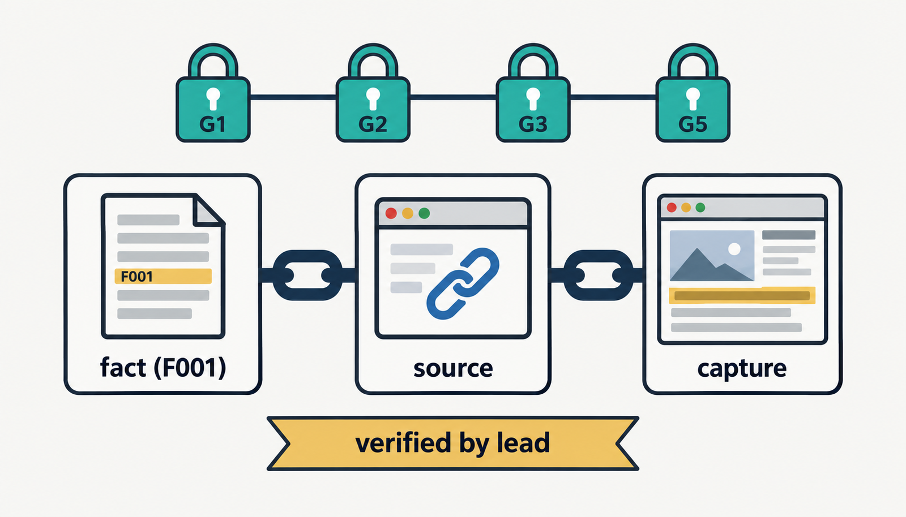
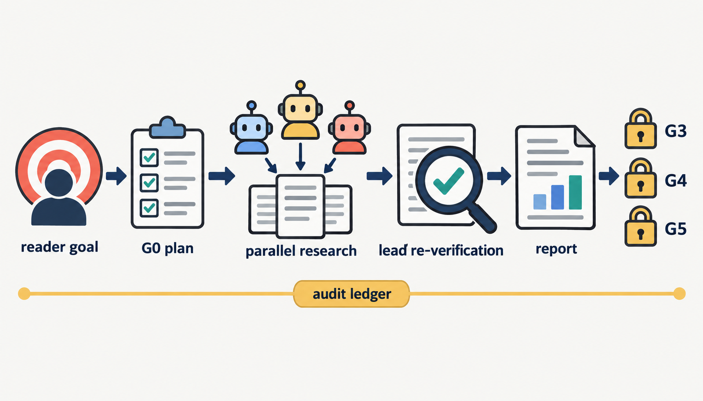
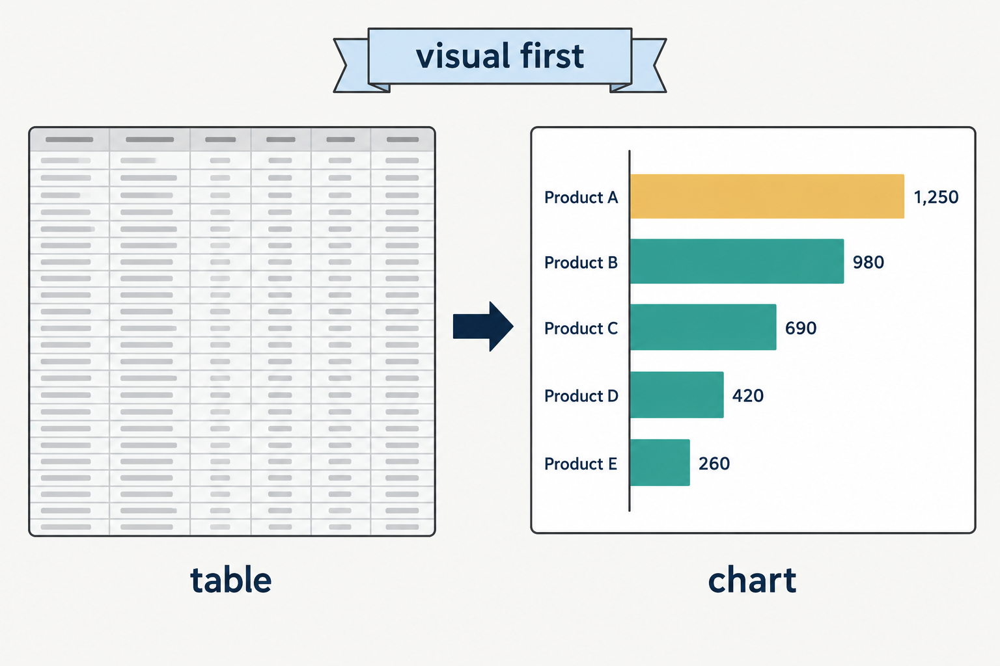

# market-deep-research

**증빙형(evidence-based) 시장조사 보고서 스킬** — Claude Code 스킬 `market-deep-research`(+ `mdr-hwpx` 납품 양식화)의 정본 저장소입니다.



AI 딥리서치는 같은 질문을 두 번 물으면 다른 숫자를 내놓고, 근거 링크를 눌러 보면 그 숫자가 없는 일이 흔합니다. 이 스킬은 그 문제를 **구조로** 막습니다 — 모든 수치·주장을 **[사실(fact) → 출처(source) → 화면캡처(capture)]** 로 결박하고, 게이트를 통과한 것만 보고서에 실립니다. 그리고 2026-10 부터는 조사를 시작하기 전에 **"누가 이 문서를 들고 누구를 설득해 무엇을 결정하는가"** 를 먼저 정합니다 — 사실 검증이 완벽해도 독자와 목표가 비어 있으면 "내용에 코어가 없는" 보고서가 나오기 때문입니다.

```
codes/market-deep-research/   ← 스킬 본체 (정본)
codes/mdr-hwpx/               ← 원고 md → 발주처 양식 hwpx 변환 스킬
_planning/                    ← 설계·리뷰 기록
lessons.md                    ← 실전에서 얻은 교훈 누적
```

조사 실행 산출물(`research_*/`)과 수집 로그(`audit/`)는 저장소에 커밋하지 않습니다(`.gitignore`).

---

## 2026-10 업데이트 — 무엇이 달라졌나

네 건의 실전 조사(연간 업데이트 보고서·출연연 기술 BM·문헌 조사·사업화 전략 용역)에서 반복된 사고를 스킬로 올렸습니다.

| 들어온 것 | 왜 | 어디 |
|---|---|---|
| **독자·목표 설계 §0** — 의뢰인·1차 독자·설득 대상·독자의 결정·**핵심 메시지 가설**·관점·우리 기술 근거·입력 자료 지위를 G0 맨 앞에서 확정 | 조사가 끝난 뒤 독자·관점을 재정의해 전면 재집필한 사고 3건. 핵심 메시지는 **가설**로 두고 축별 intent-diff 가 검증, 반증되면 교체·기록 | `references/reader-goal.md` |
| **시각화 우선(visual-first)** — 수치 데이터는 그림이 기본, 표는 식별자·비교표·값 참조일 때만. `visual_audit.py` 가 본문 표 중 시각화 후보를 뽑아 표마다 판정을 남김 | 납품본이 표 23 : 그림 10 으로 쏠림. 증빙 체계가 셀 단위 F태그 결박에 최적화돼 작성자가 표로 도피 | `references/visual-first.md` · `scripts/visual_audit.py` · `docs/prd-visual-first_261008.md` |
| **G0 확정 필드 5개 추가** — 선행 문서 기준선, 의뢰인 확인 채널, high-risk 완화 방식, 납품 형식, 폐기 수치 grep | 전년판을 안 읽고 취소된 프로젝트를 '성공 모델'로 서술 · 표지·목차를 끝에서 두 번 재작업 · 완화를 기록 없이 해 반박검색이 조용히 무력화 | `references/research-plan.md` |
| **경쟁·포지셔닝 템플릿** — 대안 지도 → 비교표 → 열세 시나리오, 경쟁 범위가 갈리면 두 범주 병기 | 기술사업화 실사의 시장성 축이 조사마다 다른 구조로 나옴 | `references/competitive-positioning.md` |
| **워커 철칙 보강** — 임시 ID W접두, verbatim 리터럴, 수치에 지표 성격·시점 병기, WD 에서만 실행 | 임시 ID 오등재 43건, 재구성 인용, 스킬 폴더에 조사 로그가 쌓여 공유 저장소로 푸시 | `references/agent-briefs.md` |
| **납품본 변환 규칙** — 작성 주체 표현·내부 코드 명칭화·불확실 정보 처리·분량·참고문헌 | 증빙판 표현('조사팀 판단'·F-ID·분류 코드)이 발주처 납품본에 그대로 나가 사후 치환 130건 | `codes/mdr-hwpx/references/deliverable-rules.md` |
| **G4 독자 테스트** — 1차 독자·설득 대상·신규 독자·핵심 메시지 귀결·시각화·인쇄 가독성 | G4 육안검증이 사실·도판 정확성만 보고 "읽히는가"는 보지 않았음 | `reader-goal.md` G4 절 |

---

## 3대 절대 규칙

1. **원문 미확인 수치는 폐기** — 추정 금지. 출처 없는 주장은 사실대장(`facts.jsonl`)에 등재 자체가 불가하며, 등재되지 않은 것은 본문에 쓸 수 없습니다.
2. **팀리드 전건 재검증** — 병렬 조사원(서브에이전트)이 수집한 모든 fact 를 팀리드(메인 세션)가 **원문을 직접 다시 열람**해 인용문(verbatim)과 위치(locator)를 대조한 뒤에만 confirmed 처리합니다. 조사원 단독 확정 금지. WebFetch 요약 답은 재확인 근거가 아닙니다.
3. **고객용 / 내부 audit 분리** — 고객 PDF 에는 검증 통과분만, 폐기 목록·실패 URL·반박 상세·검증 이력은 내부 audit 번들에 전량 보존.

검증에 불통과한 모순은 침묵 폐기하지 않고 `disputed` 로 남깁니다 — **"기권이 정답"** 인 상태를 인정하는 것도 설계의 일부입니다.

---

## 어떻게 돌아가나



```
[§0]  독자·목표 ─ 의뢰인·1차 독자·설득 대상·독자의 결정·핵심 메시지 가설 확정(승인 후 동결)
[G0]  preflight ─ 의존성 점검 + 확정 필드(축·충분조건·납품 형식·승인 목차) + intent-diff 개시
[1]   병렬 조사 ─ 조사원 에이전트 팬아웃(sonnet, 에이전트별 임시폴더, 읽기전용, 스폰 첫 줄 = 독자·목표)
[E]   확장→수렴 ─ EXPAND 리드 dedup → 후속 워커 → 축별 잔여 리드 0까지 반복
[G1]  join      ─ raw 보존 · 스키마 검증 등재 · 무출처 즉시 discarded
[2]   팀리드 재검증 ─ ★전건 원문 재열람 → verify_event(by=lead)
[Bx]  반박·claim-graph ─ high-risk: 독립 관찰그룹 2+ · 반박검색 · 기본소스 · 시간증거
[G2]  증빙 게이트 ─ confirmed 전건 source_capture(핵심수치 필수)
[3]   보고서 작성 ─ 11부 표준목차 + 핵심 메시지 귀결 점검 + 시각화 판정(visual_audit) + 내부 audit
[G3]  verify_facts + manifest ─ 실패 0 · 무태그 수치 차단 · 도판검사 · CLI PASS 가 기준 manifest 봉인
[G5c] 실행코드 검증 ─ 계산·상충 주장을 스크립트로 실증(CONFIRMED/REFUTED)
[4]   render_pdf ─ pandoc → Headless Chrome, 오프라인 PDF
[4b]  재봉인    ─ extend-only(기존 항목 불변 확인, 렌더 산출물만 추가)
[G4]  preview   ─ 팀리드 육안 검증 + intent-diff 축별 대조 + 독자 테스트 + 대장→원고 역방향 고아 검사
[G5]  최종 무결성 ─ PDF F태그·링크·캡처 수 재검사 + manifest verify
```

**축 도출 체인**은 한 줄로 이어집니다: `독자·목표(핵심 메시지) → 의사결정 용도 → 조사질문 → 축 → 에이전트 배정 → 3부 챕터`. 축 이름이 이 체인 바깥에서 생기면 그 챕터는 채워지지 않습니다.

### 게이트 영수증 (`audit/gates.jsonl`)

통과 주장은 append-only 영수증으로만 성립합니다. 핵심은 **누가 기록할 수 있는가**입니다.

| 구분 | 게이트 | 기록 주체 |
|---|---|---|
| 수동 | G0 · [2] · G4 | 팀리드가 `gates.py record` (사람의 판단이 필요한 게이트) |
| **소유 스크립트 자기기록** | G3 · [4b] · G5 | `verify_facts.py` · `render_pdf.py` · `manifest.py verify` — **CLI 손기록 차단** |
| 무소유 | G1 · G5c 등 | `gates.py record_script_result` |

G3·[4b]·G5 는 손으로 기록할 수 없습니다. 소유 스크립트를 **실제로 돌린 영수증**과 안 돌리고 적은 영수증을 구별할 수 없다면 그 영수증은 영수증이 아니기 때문입니다. 실패도 기록됩니다. G0 영수증의 `--refs` 는 research-plan 같은 고정 산출물만 결박합니다 — intent-diff 처럼 수시로 바뀌는 문서를 결박하면 영수증이 무효화됩니다. 같은 이유로 §0 독자·목표는 승인 시점에 동결되고, 핵심 메시지가 반증돼 바뀌면 `intent-diff.md` 의 `현행 메시지:` 줄에 적습니다.

---

## 도판과 시각화 — 두 결정을 분리한다



**(가) 그림이냐 표냐** 는 데이터 형태로 정합니다. 시간 추이·항목 비교·비중·분포·두 변수 관계는 **그림이 기본**이고, 표는 식별자·텍스트 속성, 열마다 성격이 다른 비교표, 정확한 값 참조(부록)일 때만 남습니다. 그림을 넣었으면 같은 데이터의 표는 본문에서 뺍니다(`references/visual-first.md`).

```bash
python scripts/visual_audit.py report.md --decisions audit/visual-decisions.json
# 본문 표 중 행 3개↑·수치열 1개↑(연번·출처 열 제외)를 후보로 뽑아 제안 형식을 붙인다.
# 해결 = keep + 사유. chart 는 표를 실제로 지워야 해결. 미결 0건이 G4 조건.
```

**(나) 그림을 어디서 가져오나** — 좋은 인포그래픽은 이미 소스 보고서 안에 있습니다. 찾아서 출처와 함께 결박하는 것이 정공법입니다.

```
0. 워커 ## FIGURES 신고분   ← 원문을 직접 읽은 조사원이 지목한 도판. 가장 정확하다.
1. 소스 PDF 도판 크롭       ← 인포그래픽 점수 랭킹(명시캡션·면적·벡터밀도 ↑ / 반복 로고 ↓)
2. 확보한 웹페이지 이미지    ← og:image · figure/figcaption
3. 이미지 검색             ← 기관 도메인 직격(--sites) + openverse·commons
4. 자작 차트              ← 원문에 대응 도판이 없는 수치 데이터. make_chart.py / matplotlib, 값은 confirmed fact 에서만
```

**G3 도판검사** — 수치에 적용되는 증빙 철칙이 그림에도 같은 강도로 걸립니다.

| 검사 | 조건 |
|---|---|
| `[도판]` | 본문 대표 이미지 0장 차단 |
| `[도판경로]` | 참조 경로 실재 — 건별 판정 |
| `[도판출처]` | 참조 뒤 2줄 이내 `[그림]` 캡션 + `출처:` **값** |
| `[도판무결박]` | `assets/` 자작 차트는 캡션에 `(Fxxx)` 최소 1개 |
| `[도판커버리지]` | 3부 축 챕터별 도판 유무 — 경고 |

---

## 조사 유형 4종과 독자 유형 5종

축(조사질문 = 에이전트 분할 = 3부 챕터)은 `references/report-format.md` 의 축 프리셋이 단일 진실원입니다.

| 조사 유형 | 3부 축 |
|---|---|
| 기술동향 | 기술요소 / 플레이어 / 시장 / 정책 |
| 산업동향 | 밸류체인 / 통계(KOSIS·DART·KIPRIS) / 해외 |
| 기관·기업 실사 | 일반현황 / 사업현황 / 재무실적 (entity-identity 선고정) |
| 기술사업화 실사 | 기술성 / 권리성 / 시장성(경쟁 대안 지도 → 비교표 → 열세 시나리오) / 사업성 |

독자 유형은 §0 을 채울 때 고르는 프리셋입니다(`references/reader-goal.md`).

| 독자 유형 | 설득 대상 → 결정 | 핵심 메시지가 답해야 할 것 |
|---|---|---|
| 기술이전 희망 연구자 | 수요기업 → 기술이전 검토 착수 | 시장이 실재·성장하고, 기존 대안 대비 이 기술이 푸는 문제가 구체적이며, 도입 기업이 얻는 것이 수치로 보임 |
| 예비창업자·창업팀 | 투자자·본인 → 사업 착수·입증 과제 | 우리 접근이 경쟁 지형 어디에 서고 무엇을 입증해야 하나 |
| 사업화 주관기관·컨소시엄 | 경영진 → 어디서 먼저 사업하나 | 경쟁사 대비 강약점 → 시장·규제 → 진출 순서 |
| 연간 업데이트 독자(두 층) | 전년 독자 + 신규 독자 → 변화 파악 | 전년 기준선·올해 변화·전년 결론 판정이 한 본문에서 |
| 기관 내부 기술사업화 판단 | 자기 조직 → 진입 시장·파트너·타이밍 | 사업화 기술이 들어갈 시장과 주체의 변화 |

---

## 수집 스택 (유료 API 무의존)

- **검색** (`scripts/search.py`): DuckDuckGo HTML → SearXNG 공개 인스턴스 로테이션 → 전문 무료 API(arXiv·SEC EDGAR·Wikipedia). 내장 WebSearch 와 병행.
- **fetch** (`scripts/fetch.py`): 강방어 사이트 우회 사다리 — 도메인 라우팅 → curl_cffi TLS 지문 → **모바일 iOS 지문** → Jina Reader → Googlebot UA → RSS → Wayback → OGP. 성공 판정은 HTTP 200 이 아니라 본문 검증. 원본(raw)+정제본을 SHA-256 과 함께 보존.
- fetch.py 는 **현재 폴더** `audit/` 에 로그·스냅샷을 씁니다 — 모든 스크립트는 작업폴더(WD)에서 절대경로로 실행합니다. 스킬 폴더에서 돌리면 조사 원문이 저장소에 섞입니다.

로그인·CAPTCHA·paywall 우회는 하지 않습니다.

---

## 저장소 구조

```
codes/market-deep-research/
├─ SKILL.md                  # 오케스트레이터 본체 (파이프라인·3대 절대 규칙·참조 문서 표)
├─ assets/                   # facts-schema.json · curated-sources.json · searx-instances.json · style.html
├─ references/               # 단계별 규정 문서 13종
│  ├─ reader-goal.md         #   §0 독자·목표·핵심 메시지 가설·독자 테스트            ← 2026-10 신설
│  ├─ visual-first.md        #   그림 vs 표 결정표·차트 규칙·visual_audit 운영          ← 2026-10 신설
│  ├─ competitive-positioning.md  # 경쟁 대안 지도·비교표·포지셔닝 서술              ← 2026-10 신설
│  ├─ research-plan.md       #   G0 확정 필드·축 도출 체인·승인 목차 서식
│  ├─ agent-briefs.md        #   워커 계약·반환 마커·철칙·작성자 브리프
│  ├─ verification-gates.md  #   게이트 상세·4차원 출처등급·claim-graph
│  ├─ report-format.md       #   11부 표준목차·축 프리셋·납품본 인계 주의
│  ├─ claim-review.md        #   문장↔근거 의미 검토(원문 일치 ≠ 주장 성립)
│  ├─ source-ladder.md · evidence-capture.md · entity-identity.md · extract-recipes.md · image-research.md
├─ scripts/                  # 실행 도구 20종
│  ├─ gates.py · verify_facts.py · verify_claims.py · verify_calculations.py · manifest.py
│  ├─ facts_db.py · join_workers.py · source_index.py
│  ├─ fetch.py · search.py · capture_pdf.py · capture_web.py
│  ├─ harvest_images.py · make_chart.py · visual_audit.py                       ← visual_audit 2026-10 신설
│  └─ render_pdf.py · preview_pdf.py · preflight.py · install.py · skill_paths.py
├─ docs/                     # PRD 등 설계 기록 (prd-visual-first_261008.md)
└─ tests/                    # 적대 케이스·v4 게이트·의미 검토 테스트

codes/mdr-hwpx/              # 원고 md → 발주처 양식 hwpx (부별 모듈 빌드·정합성 검토·합본)
└─ references/deliverable-rules.md   # 증빙판 → 납품본 변환 규칙                        ← 2026-10 신설
```

## 조사 1건의 산출물

```
research_<주제>_<YYYYMMDD>/
├─ report.pdf            # 고객용 팩트시트 (11부 표준목차, 수치마다 (F###) 태그)
├─ report.md             # 생성 소스 (직접 수정 금지 — facts.jsonl 수정 후 재렌더)
├─ _captures/            # fact별 원문 화면캡처 (E###.png + 메타)
├─ _images/              # 대표 도판 + IMAGES.md 인덱스
├─ assets/               # 자작 차트 (스크립트와 PNG 모두 여기)
└─ audit/                # 내부 전용: research-plan.md(§0 포함) · intent-diff.md · facts.jsonl ·
                         # gates.jsonl · visual-decisions.json · 폐기 목록 · raw 워커 출력 · manifest
```

**단일 진실원은 `facts.jsonl`입니다.** 보고서는 생성물이므로 본문 수치를 직접 고치는 행위는 금지되며, 대장을 고치고 재렌더해야 합니다 — G3/G5 게이트가 이 동기화를 기계로 강제합니다.

## 설치·실행

| 목적 | 스킬 |
|---|---|
| ① 검색만 | `mdr-search` |
| ② 증빙형 보고서 초안(MD/PDF) | `market-deep-research` |
| ③ 양식화: 원고 md → 양식 hwpx | `mdr-hwpx` |

```bash
# 의존성 점검 (HARD: python>=3.10, PyMuPDF, pandoc, chrome / SOFT: curl_cffi, trafilatura …)
python codes/market-deep-research/scripts/preflight.py

# ~/.claude/skills/{market-deep-research,mdr-search,mdr-hwpx}/ 로 설치 (SHA-256 해시 검증 복사)
# ⚠ 각 allowlist 스킬 폴더 안만 mirror-sync(초과 파일 삭제). 인자 없이 즉시 실행됩니다
python codes/market-deep-research/scripts/install.py

# 설치본이 저장소와 같은지 쓰지 않고 대조 (불일치 시 exit 1)
python codes/market-deep-research/scripts/install.py --check
```

설치 후 Claude Code 에서 "증빙/캡처 포함 시장조사 보고서", "기술동향·산업동향 조사", "기술사업화 실사", "근거 있는 딥리서치 PDF" 류의 요청이 이 스킬로 라우팅됩니다. 실전에서는 설치본에서 고친 변경이 먼저 생기기도 하므로, 조사 직전 `--check` 로 드리프트를 확인하고 변경분은 이 저장소 `codes/` 로 동기화합니다.

## 검증 현황 (2026-10-08)

```
visual_audit.py --selftest : OK  (실전 report.md 1건: 후보 11건 추출, 연번 열 오탐 0)
verify_facts.py demo       : OK  (승인 목차 파서 12부·4축 그대로)
독립 리뷰                  : opus 2회(독자·목표 묶음 13건·시각화 묶음 13건 지적 → 반영)
알려진 결함                : tests/test_v4_gates.py 가 finalize_report 모듈 부재로 수집 실패
```

## 개발 이력

| 변경 | 내용 |
|---|---|
| 2026-10-08 | 독자·목표 설계(reader-goal) G0 신설 · 시각화 우선(visual-first) PRD·규칙·`visual_audit.py` · G0 필드 5개 · 워커 철칙 · 납품본 변환 규칙(mdr-hwpx) |
| [#18](https://github.com/bbiyakfather/market-deep-research/pull/18) | 목적별 모듈화(mdr-search / market-deep-research / mdr-hwpx) + P0 검증 결함 수정 + 적대적 리뷰 결함 29건 처리 |
| [#17](https://github.com/bbiyakfather/market-deep-research/pull/17) | README 를 실제 main 상태로 재작성 |
| [#16](https://github.com/bbiyakfather/market-deep-research/pull/16) | 도판검사 우회로 4건 차단 + 설치본 드리프트 감시(`--check`) |
| [#15](https://github.com/bbiyakfather/market-deep-research/pull/15) | 완성 인포그래픽 탐색 하네스 — `## FIGURES` 마커, 도판 랭킹, G3 도판검사 |
| [#14](https://github.com/bbiyakfather/market-deep-research/pull/14) | 영수증 소유권 확립 — 소유 게이트 CLI 손기록 차단, G5 자기기록 |
| [#13](https://github.com/bbiyakfather/market-deep-research/pull/13) | 스킬 고도화 — 수집·검증 하네스 |

브랜치 정리(2026-08-10) 기록과 복구 명령은 `_planning/branch-cleanup-2026-08-10.md` 에 있습니다.
