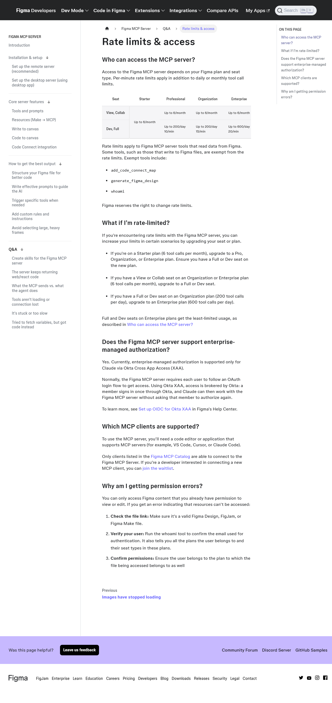

# Figma MCP × Cursor 셀프 학습 조사 팩트시트

| 항목 | 내용 |
|---|---|
| 조사 주제 | Figma MCP + Cursor + Supabase + n8n + 토스페이먼츠 기반 웹/앱 제작 독학 경로 |
| 조사 목적 | FastCampus 강의 주제를 공개 자료만으로 학습할 수 있는 노션 가이드 제작의 사실 기반 확보 |
| 조사 유형 | 기술동향 + 학습 리소스 큐레이션 |
| 기준일 | 2026-07-23 (전 사실 원문 재열람 확인일) |
| 검증 체계 | market-deep-research: 병렬 조사 2웨이브 → 팀리드 전건 재검증 → 사실대장 등재 |

## 1. Executive Summary

- **Figma 공식 MCP 서버는 실사용 시 유료 시트가 필요하다.** 무료 Starter 플랜은 월 6회 호출뿐이며(F004), 이 제한은 커뮤니티 대체재(Framelink)를 써도 그대로 적용된다(F012) — "무료 우회"는 통념과 달리 불가능. 실습에는 Professional Dev seat($12/월, 연간 청구) 이상이 현실적 최소선이다(F006).
- **Cursor 연결은 공식 원클릭 경로가 확립됐다.** 에이전트 채팅에 `/add-plugin figma` 입력 → Customize/설정에서 Connect(F008). 2026-06 v3.9부터 MCP 관리 UI가 'Customize' 페이지로 통합돼(F092) 일부 공식 문서 간 메뉴 명칭이 다르게 보일 수 있다.
- **토스페이먼츠가 PG 최초로 공식 MCP 서버를 제공한다**(F102). Cursor에 붙이면 결제 연동 문서를 AI가 직접 검색하며, 테스트 키는 사업자 등록 없이 발급된다(F055) — 결제 실습 진입장벽이 낮다.
- **Supabase(무료 2프로젝트·500MB·50K MAU)와 n8n(셀프호스트 무료)** 조합으로 로그인·DB·자동화 실습은 전액 무료로 가능하다(F039)(F045).
- 실습 3종(숙박 예약/OTT 구독/모바일 앱)은 각각 공개 대체 학습경로가 존재함을 확인했다. 단 '결제 포함 OTT 클론'의 한국어 단일 완결 자료는 없어, 공식 문서+블로그 조합 경로를 제시한다(9장 한계 참조).

## 2. 어떻게 조사했나

- 조사원 9명(2웨이브) 병렬 수집 → 팀리드가 전 사실을 원문 재열람으로 재검증.
- 증거: 사실 116건 confirmed(전건 팀리드 verify_event), 3건 폐기(사유 audit 기록), 리소스 89건 링크 게이트(전건 접근 확인) 통과, 원문 스냅샷 SHA-256 고정.
- 소스 원칙: 공식 문서(developers.figma.com, cursor.com/docs, supabase.com/docs, docs.n8n.io, docs.tosspayments.com) 최우선. 공식과 상충하는 블로그 절차 폐기.

## 3. 테마별 확인 사실

### Figma Dev Mode MCP Server — 세팅·요금·무료 대체재

- Figma 데스크톱 앱에서 MCP 서버를 켜는 절차는 앱을 최신 버전으로 업데이트 → Figma Design 파일을 열고 하단 툴바에서 Dev Mode로 전환(단축키 Shift+D) → Inspect 패널의 MCP server 섹션에서 'Enable desktop MCP server' 클릭이며, 이때 로컬 서버 주소는 http://127.0.0.1:3845/mcp 로 고정 표시된다. (F001)
- Figma가 공식적으로 권장하는 방식은 데스크톱 앱 설치 없이 쓸 수 있는 원격(remote) MCP 서버이며, 엔드포인트는 https://mcp.figma.com/mcp 이고 접속 시 Figma OAuth 로그인 절차를 거쳐야 한다. (F002)
- Figma MCP 서버는 아무 편집기나 연결되는 것이 아니라 Figma MCP Catalog에 등재된 클라이언트(VS Code, Cursor, Claude Code 등)만 연결이 허용된다. (F003)
- 무료 Starter 플랜에서도 Figma MCP 서버(원격) 자체는 켤 수 있지만 월 6회 호출로 제한되며, 이 제한을 풀려면 유료 플랜(Pro/Organization/Enterprise)으로 업그레이드하면서 Dev 또는 Full 시트를 받아야 한다. **[high]** (F004)
- MCP 서버 접근에는 유료 플랜의 Dev 또는 Full 시트가 필요하며, 그중에서도 Figma 파일에 실제로 쓰기(write to canvas, use_figma 도구)까지 하려면 Full 시트가 있어야 한다 — Dev 시트는 드래프트 밖에서는 읽기 전용(디자인 컨텍스트·스크린샷·메타데이터·변수 정의 등)만 가능하다. **[high]** (F005)
- Figma Professional 플랜 가격은 공식 페이지 정적 렌더링 기준(연간 청구가 기본 선택된 상태) Full seat $16/mo, Dev seat $12/mo이다. **[high]** (F006)
- Figma MCP 서버 호출 한도는 시트·플랜별로 표로 정해져 있다: 모든 플랜의 View/Collab 시트와 Starter 플랜은 시트 종류와 무관하게 월 6회, Professional Dev/Full 시트는 1일 200회(분당 10회), Organization Dev/Full 시트는 1일 200회(분당 15회), Enterprise Dev/Full 시트는 1일 600회(분당 20회)까지 허용된다. **[high]** (F007)
- Cursor에서 원격 MCP 서버를 붙이는 공식 권장 방법은 Cursor 에이전트 채팅창에 `/add-plugin figma`를 입력해 Figma 플러그인(설정+Agent Skills 포함)을 설치한 뒤 Cursor Settings > Tools & MCP > Installed MCP Servers에서 Connect를 눌러 인증하는 것이다. (F008)
- Figma 데스크톱 서버를 Cursor에 수동으로 붙일 때는 mcp.json에 {"mcpServers": {"figma-desktop": {"url": "http://127.0.0.1:3845/mcp"}}} 를 그대로 넣으면 되며, 이는 VS Code가 같은 상황에서 "servers" 키를 쓰는 것과 최상위 키 이름이 다르다. (F009)
- 무료 플랜 사용자를 위한 대표적 커뮤니티 대체재는 Framelink Figma MCP(npm 패키지명 figma-developer-mcp, GitHub 저장소 GLips/Figma-Context-MCP)이며, GitHub 실측 기준 스타 15,481개·포크 1,219개·오픈 이슈 21건·최근 커밋 2026-07-03로 활발히 유지보수되고 있다. (F011)
- Framelink Figma MCP(figma-developer-mcp) 같은 커뮤니티 대체재도 내부적으로 Figma 개인 액세스 토큰(personal access token)으로 Figma REST API를 호출하므로, Starter(무료) 플랜의 파일에 대해서는 공식 MCP와 동일하게 월 6회 요청 제한이 그대로 적용된다 — 커뮤니티 도구를 쓴다고 해서 무료 플랜의 요청 한도를 우회할 수 있는 것은 아니다. **[high]** (F012)
- Figma 공식(figma/mcp-server-guide 저장소)이 제시하는 디자인→코드 품질 향상 best practice는 버튼·카드·인풋처럼 재사용되는 요소를 컴포넌트로 만들고, 그 컴포넌트를 Code Connect로 실제 코드베이스와 연결하고, 간격·색상·라운드·타이포그래피를 변수(variable)로 관리하고, 레이어 이름을 'Group 5' 대신 'CardContainer'처럼 시맨틱하게 짓고, Auto Layout으로 반응형 의도를 표현하는 것이다. (F013)
- Figma MCP 서버의 핵심 한계는 한 번에 너무 큰 화면(대형 프레임)을 통째로 선택해서 코드 생성을 요청하면 느려지거나 오류가 나거나 응답이 불완전해질 수 있다는 것이며, 공식 권장 대응은 화면을 컴포넌트·논리적 단위로 잘게 쪼개서 요청하는 것이다. (F014)
- Figma MCP의 'write to canvas'(코드/에이전트가 Figma 캔버스에 직접 컴포넌트·변수·프레임을 쓰는 기능, use_figma 도구)는 2026-07-23 기준 베타 기간 동안 무료로 제공되지만, Figma는 이 기능을 향후 사용량 기반(usage-based) 유료 기능으로 전환할 계획이라고 공식적으로 밝히고 있다. **[high]** (F015)

### Cursor·Figma 최신 동향 (2026 상반기 변경·AI credits·Figma Make)

- Cursor 공식문서 기준 MCP 서버 등록·관리는 'Settings' 메뉴가 아니라 'Customize' 페이지에서 이루어지며, 마켓플레이스 항목은 'Add to Cursor' 버튼으로 원클릭 설치·OAuth 인증한다. (F084)
- Cursor의 mcp.json은 프로젝트 범위(.cursor/mcp.json)와 전역 범위(~/.cursor/mcp.json) 두 곳에 둘 수 있고, mcpServers 객체 아래 stdio(command/args/env) 또는 remote(url/headers) 방식으로 서버를 정의한다. (F085)
- Figma 공식 가이드(Cursor and Figma: Set up the MCP server)는 Cursor 내 연결 경로를 'Cursor Settings > Tools & MCP > Installed MCP Servers > Connect'로 안내하는데, 이는 Cursor 자체 최신 공식문서가 쓰는 'Customize' 페이지 명칭과 다르다 — 두 공식 소스 간 UI 명칭 시점 불일치 가능성이 있어 원문 그대로 병기함. (F086)
- Cursor 설치 절차(공식 Help 문서)는 Windows에서 'Run the installer and follow the prompts', Mac에서 'Drag Cursor into your Applications folder'로 안내되며, cursor.com/download에서 OS별 다운로드 버튼을 클릭하는 방식이다. Wave1에서 403이던 docs.cursor.com/get-started/installation은 이번 재시도에서 308 리다이렉트로 cursor.com/docs(문서 홈)로 이동했고, 별도의 전용 'Installation' 페이지는 존재하지 않는다(Quickstart 페이지에 설치 안내가 통합됨). (F087)
- Cursor Quickstart 공식문서의 설치 관련 시스템 요구사항은 macOS 'macOS 12 (Monterey) and later'(Apple Silicon/Intel 지원, .dmg 네이티브 설치), Windows 'Windows 10 and later'(.exe 네이티브 설치)이다. (F088)
- Cursor changelog 2026-01-08 'New CLI Features and Improved CLI Performance'에서 '/mcp enable', '/mcp disable' 커맨드가 추가되어 MCP 서버를 즉석에서 켜고 끌 수 있게 됐다 — 기능 변경이며 요금 변경 언급은 없다. (F089)
- Cursor changelog 2026-03-03(v2.6) 'MCP Apps and Team Marketplaces for Plugins'에서 MCP Apps 기능이 도입되어 Amplitude 차트, Figma 다이어그램, tldraw 화이트보드 같은 대화형 UI를 Cursor 안에서 직접 띄울 수 있게 됐다 — 기능 변경이며 요금 변경 언급은 없다. (F090)
- Cursor changelog 2026-06-04 'Custom stores, custom tools, and auto-review for the Cursor SDK'에서 로컬 에이전트에 커스텀 툴을 연결(local.customTools)하고 승인 절차를 자동화(local.autoReview)하는 SDK 기능이 추가됐다 — SDK 대상 기능 변경이며 가격 변경 언급은 없다. (F091)
- Cursor changelog 2026-06-22(v3.9) 'Customize Cursor'에서 플러그인·스킬·MCP·서브에이전트·규칙·커맨드·훅을 사용자/팀/워크스페이스 단위로 한 곳에서 관리하는 신규 'Customize' 페이지가 출시됐다 — UI 통합 개편이며 요금 변경 언급은 없다. (F092)
- Figma AI credits는 요금제·시트 종류별로 월간 배정량이 다르며(Full seat 기준), Professional 3,000/월, Organization 3,500/월, Enterprise 4,250/월, Starter 500/월이고 Dev·Collab·View 시트는 모든 플랜에서 공통 500/월이다. **[high]** (F093)
- Figma MCP 서버(도구 호출) 자체가 AI credits를 소모하는지는 공식문서에서 명시적으로 확인되지 않는다 — help.figma.com의 'credits를 소모하는 기능 전체 목록'(Figma Make, AI search, Rename layers, FigJam AI 기능들, 이미지 편집 기능들 등)에 MCP·Dev Mode·코드생성 관련 항목이 없어 간접적으로는 '소모하지 않는다'는 쪽으로 기울지만, developers.figma.com/help.figma.com 어디에도 'MCP 호출은 credits를 소모하지 않는다'는 직접 문장은 없다. 유일하게 확인되는 관련 문구는 MCP의 '캔버스에 쓰기' 기능이 현재 베타 기간 무료이며 향후 별도의 사용량 기반 유료 기능이 될 것이라는 내용으로, 이는 AI credits 시스템과 명시적으로 연결되지 않는다. → 확인 불가로 기록. **[high]** (F094)
- Figma Make는 'AI-driven, prompt-to-app tool'로, 아이디어와 기존 Figma 디자인을 기능하는 프로토타입·웹앱·인터랙티브 UI로 만들어주는 도구이며 Full 시트에 포함(Dev/Collab/View 시트는 초안에서만 체험 가능)된다. 공식문서(Explore Figma Make, Figma Make FAQs)에는 Figma Make와 Figma MCP 서버·Cursor 같은 외부 코드 에디터 워크플로 간의 관계를 직접 설명하는 문장이 없다 — 둘은 제품 목록에서 별개 항목(Dev Mode='Translate designs into code', Figma Make='Prompt to code anything you can imagine')으로만 병기된다. (F095)

### Cursor AI 에디터 — 설치·기능·요금·MCP 등록

- Windows에서는 설치 파일(installer)을 실행하고 화면의 안내(prompt)를 따르면 설치가 완료된다. (F016)
- Mac에서는 다운로드한 Cursor 아이콘을 Applications 폴더로 드래그하면 설치가 완료된다. (F017)
- Cursor를 쓰려면 사전에 무료 Cursor 계정을 만들어야 하고, 설치 후 첫 실행 시 안내에 따라 로그인해야 한다. (F018)
- Cursor 공식 웹사이트(cursor.com)는 한국어 등 여러 언어로 제공되지만, 에디터 앱 자체의 인터페이스(UI) 언어를 한국어로 바꾸는 공식 설정은 공식 문서(설치/도움말 페이지)에서 확인되지 않는다. (F019)
- Tab은 Cursor의 AI 자동완성 기능으로, 최근 편집 이력·주변 코드·린터 오류를 근거로 타이핑 중 코드를 제안한다. (F020)
- Cmd/Ctrl+K(Inline Edit)는 채팅 패널을 열지 않고 선택한 코드 범위를 즉시, 국소적으로 수정하는 기능이다. (F021)
- Chat(Ask 모드)는 코드를 변경하지 않고 코드베이스를 이해·탐색하며 질문에 답하는 읽기 전용(read-only) 모드다. (F022)
- Agent 모드는 기능을 처음부터 만들고, 리팩터링하고, 버그를 고치고, 테스트를 작성하고, 셸 명령을 실행하는 등 복잡한 코딩 작업을 독립적으로 수행하는 Cursor의 어시스턴트다. (F023)
- Cursor Rules는 Agent에게 주는 시스템 수준 지시문으로, 프롬프트·스크립트 등을 하나로 묶어 팀 전체가 워크플로를 관리·공유할 수 있게 한다. (F024)
- 프로젝트 규칙(Project Rules)은 프로젝트 폴더 안 .cursor/rules 경로에 .mdc 확장자 파일로 저장되며 버전관리(git) 대상이 된다. (F025)
- AGENTS.md는 메타데이터 없이 순수 마크다운으로 에이전트 지시사항을 정의하는 파일로, 프로젝트 루트에 두며 .cursor/rules의 대안으로 쓸 수 있다. 현재 공식 문서에는 .cursorrules(구 단일 파일)에 대한 언급이 없고 .cursor/rules(.mdc)와 AGENTS.md만 공식 형식으로 안내된다. (F026)
- MCP 서버는 (1) Customize 화면의 Cursor Marketplace에서 원클릭 설치, (2) Cursor Settings UI, (3) mcp.json 파일 수동 작성 중 하나로 등록할 수 있다. (F027)
- mcp.json은 프로젝트 전용이면 프로젝트 폴더의 .cursor/mcp.json, 모든 프로젝트에서 공용으로 쓰려면 홈 디렉터리의 ~/.cursor/mcp.json에 두며, mcpServers 객체 아래 서버 이름별로 command/args/env(로컬) 또는 url/headers(원격)를 지정하는 JSON 형식을 쓴다. (F028)
- 2026년 7월 현재 Hobby 플랜은 신용카드 없이 무료로 가입 가능하며, 'Limited Agent requests'와 'Limited Tab completions'로만 한도가 표시될 뿐 공식 페이지에 정확한 숫자 한도는 공개돼 있지 않다. **[high]** (F029)
- 2026년 7월 현재 Pro(Individual) 플랜은 월 $20이며, Tab 자동완성은 무제한, Agent 사용 한도는 확장(extended)되고 Bugbot·Cloud Agents 접근이 포함되지만, 공식 문서는 하루/월 단위의 구체적 요청 횟수를 숫자로 명시하지 않고 'Cursor Models 풀'과 'Other Models(3rd-party) 풀' 두 사용량 풀 구조로만 설명한다. **[high]** (F030)

### Supabase — 프로젝트·테이블·인증(Auth)·무료 한도

- Supabase 대시보드에서 새 프로젝트를 만드는 첫 단계는 조직(organization)의 Dashboard에서 New project를 생성하는 것이다. (F031)
- 테이블은 코드 없이 대시보드의 Table Editor에서 New Table로 이름을 정해 만들고, New Column으로 컬럼명과 데이터 타입(예: text)을 지정해 추가한다. (F032)
- 테이블 생성 시 각 컬럼의 데이터 타입을 반드시 지정해야 하며, 생성 후에도 언제든 컬럼을 추가/삭제할 수 있다. (F033)
- Supabase Next.js quickstart는 프로젝트 생성 → instruments 테이블·샘플 데이터 생성 및 Row Level Security(RLS) 활성화 → Next.js 앱에서 데이터를 조회해 화면에 렌더링하는 순서로 진행된다. (F034)
- Supabase Auth는 이메일/비밀번호 방식의 회원가입·로그인을 공식 기능으로 제공하며, Google을 포함한 소셜 로그인(Social Auth)을 별도 가이드로 지원한다. (F035)
- Google 소셜 로그인을 붙이려면 Google Auth Platform 콘솔에서 Web application 유형 OAuth 클라이언트를 만들어 Authorized redirect URIs에 Supabase 콜백 URL(로컬은 http://127.0.0.1:54321/auth/v1/callback)을 등록하고, 발급된 Client ID/Secret을 Supabase Dashboard의 Google provider 설정에 입력한다. (F036)
- Next.js용 Auth quickstart는 프로젝트 생성 → Next.js 앱 생성 → .env.example을 .env.local로 바꿔 Supabase 연결 변수 채우기 → 개발 서버 실행 후 /auth/sign-up 페이지에서 회원가입하는 절차로 구성된다. (F037)
- React Native/Expo용 Auth quickstart는 프로젝트 생성 → create-expo-app으로 앱 생성 → supabase-js 등 의존성 설치 → lib/supabase.ts 헬퍼 파일 작성 → App.tsx에 Auth 컴포넌트 추가 순서로 진행되며, 로그인 후 사용자 id를 화면에 표시하는 예제를 포함한다. (F038)
- Supabase 무료(Free) 플랜 한도는 활성 프로젝트 최대 2개, 데이터베이스 500MB, 월간 활성 사용자(MAU) 50,000명, egress 5GB(+캐시된 egress 5GB), 파일 저장소 1GB이며, 1주일간 API 요청이 없으면 프로젝트가 자동 일시정지된다. **[high]** (F039)
- Supabase는 Cursor 등 AI 에디터가 Supabase 프로젝트와 직접 대화할 수 있게 하는 공식 MCP(Model Context Protocol) 서버를 제공하며, Cursor에서는 .cursor/mcp.json 파일에 서버 설정을 추가해 연동한다. (F040)
- Supabase 공식 MCP 서버를 Cursor에 연결하는 현재 공식 방법은 .cursor/mcp.json에 {"mcpServers":{"supabase":{"url":"https://mcp.supabase.com/mcp"}}} 를 넣는 URL 방식이며, 지원 클라이언트 목록에 Cursor가 명시돼 있다. (F041)
- RLS(Row Level Security)는 노출된(exposed) 스키마의 모든 테이블에 반드시 켜야 하며, 켜져 있으면 정책(policy)이 모든 쿼리에 자동으로 WHERE절을 추가하는 것과 같은 방식으로 동작한다고 이해하면 된다. (F042)

### n8n — 시작 방법·크롤링 워크플로·법적 유의

- n8n Cloud는 연간 결제 기준 Starter 20€/월(2,500 executions), Pro 50€/월(10,000 executions), Business 667€/월(40,000 executions) 요금제이며, 월간 결제 시 각각 24€/60€/800€ 수준이다. **[high]** (F043)
- n8n Cloud는 Starter/Pro 플랜에 신용카드 없이 체험 가능하고, Business 플랜은 신용카드 등록이 필요한 14일 체험을 제공한다. (F044)
- n8n의 self-hosted Community Edition은 GitHub에서 무료로 제공되는 표준 버전이다. (F045)
- n8n을 Docker로 self-host하는 공식 절차는 `docker volume create n8n_data` 실행 후 `docker run -it --rm --name n8n -p 5678:5678 -e GENERIC_TIMEZONE=... -e TZ=... -v n8n_data:/home/node/.n8n docker.n8n.io/n8nio/n8n` 명령으로 로컬 5678 포트에서 접속하는 방식이며, 공식 문서는 self-host를 서버/컨테이너 설정, 리소스 관리, 보안 역량을 갖춘 "expert users"에게 권장한다. (F046)
- HTTP Request 노드는 REST API를 가진 모든 앱/서비스에서 데이터를 조회하도록 요청을 보내는 n8n의 범용 노드로, DELETE/GET/HEAD/OPTIONS/PATCH/POST/PUT 메서드를 선택할 수 있다. (F047)
- n8n의 HTML 노드(버전 0.213.0부터 이전 HTML Extract 노드를 대체)는 'Extract HTML Content' 동작에서 CSS Selector와 반환 유형(속성/HTML/텍스트/값)을 지정해 HTML 소스에서 원하는 데이터를 추출한다. (F048)
- n8n 공식 워크플로 템플릿 갤러리에는 HTTP Request 노드로 여러 공개 API를 매일 수집해 정규화한 뒤 Supabase(Postgres) 테이블과 Google Sheets에 동시에 적재하는 예시 워크플로가 게시되어 있다. (F049)
- GitHub의 커뮤니티 저장소 awesome-n8n-templates는 280개 이상의 무료 n8n 자동화 템플릿을 모아두었고, 이 중 Google Drive&Sheets 카테고리에 13개, Supabase 관련 템플릿이 5개 포함되어 있다. (F050)
- robots.txt는 검색엔진 크롤러에게 접근 가능한 URL을 알려주는 파일이지만, Google Search Central 공식 문서에 따르면 이 지침에 법적 강제력은 없고 크롤러가 자발적으로 따를지 여부에 달려 있다. (F051)
- 유럽개인정보보호위원회(EDPB)가 2026년 7월 7일 채택한 가이드라인은 웹 스크래핑이 개인정보 처리(수집·저장·조직화·검색)를 포함할 경우 GDPR이 적용된다고 명시한다. (F052)
- 인포그랩(InfoGrab)이 자체 개발한 자동번역 프로그램으로 n8n 공식 문서의 한국어판을 국내 최초로 제공하며, Level 1(기초 편집기 UI·미니 워크플로)·Level 2(데이터 구조·병합·분할·오류 처리) 등 단계별 커리큘럼으로 구성되어 있다. (F053)

### 토스페이먼츠 — 테스트 환경·결제위젯

- 테스트 환경에서는 카드 번호 등 실제 결제 정보를 입력해도 결제가 가상으로만 승인되며, 실제 결제수단에서 돈이 출금되지 않는다. **[high]** (F054)
- 이메일·전화번호만으로 가입하는 '개발 연동 체험 상점' 단계에서는 사업자등록 없이도 API 로그 확인, 웹훅 설정·연결, 가상계좌 모의입금까지 테스트할 수 있다. **[high]** (F055)
- 정산(실제 결제금이 사업자 계좌로 입금되는) 기록은 라이브 환경에서만 조회할 수 있어, 테스트 키만으로는 실제 정산 과정까지 학습할 수 없다. **[high]** (F056)
- 테스트 환경에서 발급되는 가상계좌는 번호 앞에 'X'가 붙는 가짜 계좌라 실제로 입금할 수 없다. **[high]** (F057)
- 카카오페이는 테스트 키로 연동 자체가 불가능하며 전자결제 계약 체결 후 발급되는 상점 전용 MID 테스트 키로만 가능하고, 페이코는 테스트 키 대신 라이브 키로만 테스트해야 한다. **[high]** (F058)
- 자동결제(빌링)는 리스크 검토와 별도 계약을 완료해야 실제 서비스에 쓸 수 있고, 정기 구독형 서비스가 아니면 정책적으로 사용이 제한된다. **[high]** (F059)
- 테스트 환경에서는 카드번호 앞 여섯 자리(BIN 번호)만 유효해도 자동결제(빌링키)가 등록되므로, 실계약 전에도 빌링키 발급~자동결제 흐름을 연습할 수 있다. **[high]** (F060)
- 결제위젯은 주문서 페이지에 결제 UI 영역을 직접 넣는 '주문서형'과, 결제하기 버튼 클릭 시 팝업으로 호출하는 '결제창형' 두 가지 연동 방식을 제공한다. (F061)
- 결제위젯 연동은 상점관리자(어드민)의 '결제 UI 설정 메뉴'에서 UI를 만든 뒤, 해당 variantKey를 복사해 코드에 넣는 절차로 진행된다. (F062)
- 개발자센터는 결제위젯 연동을 시작하기 전, 내 상점의 업종이 입점 불가·제한 업종인지부터 확인하라고 안내한다. (F063)
- 공식 GitHub의 SDK v1 샘플 저장소(payment-widget-sample)조차 README에서 더 편리한 연동을 위해 SDK v2 사용을 직접 권장하고 있어, 한국어 튜토리얼을 볼 때 v1/v2 버전 확인이 필요하다. (F064)
- 공식 GitHub 저장소 tosspayments-sample은 결제연동 샘플 프로젝트로, Express+React·Express+Vue 등 프레임워크 조합별 폴더를 제공한다. (F065)
- 공식 블로그(토스페이먼츠 작성, 2023.03.06) 'React로 결제 페이지 개발하기'는 Vite 기반 React 프로젝트에서 npm install @tosspayments/payment-widget-sdk로 SDK를 설치하고 loadPaymentWidget/renderPaymentMethods/requestPayment를 사용해 결제위젯을 붙이는 절차를 제시한다(단 2023년 기준 v1 패키지명). (F066)
- 자동결제 승인은 구독 서비스의 결제 주기(결제일)마다 저장해둔 빌링키로 원하는 금액을 승인 요청하는 방식으로 이뤄지며, 이 승인 API를 언제 호출할지 정하는 스케줄링 자체는 개발자가 별도로 구현해야 한다. (F067)
- 테스트 환경에서는 각 API가 분당 100건의 요청 제한을 두고 있어, 반복 실습 시 이 한도를 감안해야 한다. (F068)

### 토스페이먼츠 SDK v2·공식 MCP 서버·빌링

- v2(@tosspayments/tosspayments-sdk) 설치는 script 태그(https://js.tosspayments.com/v2/standard) 또는 npm install @tosspayments/tosspayments-sdk --save 두 가지 방식이다. (F096)
- v2 결제위젯 핵심 흐름은 loadTossPayments()(또는 TossPayments())로 초기화 → widgets({customerKey})로 인스턴스 생성 → renderPaymentMethods() 호출 전 반드시 setAmount()로 금액 설정 → renderPaymentMethods({selector, variantKey})를 비동기로 호출해 UI 렌더링하는 순서다. (F097)
- 결제 요청은 widgets.requestPayment({orderId, orderName, successUrl, failUrl, ...})로 호출하며, 성공 시 successUrl로 paymentKey·orderId·amount 쿼리 파라미터와 함께 리다이렉트되고, 가맹점 서버는 amount가 최초 요청 금액과 일치하는지 검증한 뒤 시크릿 키로 결제 승인(confirm) API를 호출해 결제를 완료해야 한다. (F098)
- v1은 결제위젯·브랜드페이·결제창이 각각 별도 스크립트/SDK로 분리돼 있었으나 v2부터는 스크립트 하나(/v2/standard)와 SDK 하나(@tosspayments/tosspayments-sdk)로 통합됐고, API 엔드포인트(v1 그대로)와 API 키는 v1·v2 공통으로 변경 없이 쓸 수 있다. (F099)
- 결제위젯 API 변경점: v1의 updateAmount()는 제거되고 setAmount()로 분리, renderPaymentMethods()/renderAgreement()가 동기→비동기로 전환, v1의 ready 이벤트 및 Pro 커스텀 이벤트(customRequest 등)가 모두 제거되고 paymentMethodSelect 이벤트로 통합, UI 삭제용 destroy() 메서드 신규 추가(한 페이지에 결제수단/약관 UI는 각 1개만 렌더링 가능해 재렌더링 전 destroy 필요). (F100)
- v2는 아직 React Native·Flutter 등 모바일 네이티브 SDK를 지원하지 않아 모바일 앱 연동은 v1을 써야 하며, 토스페이먼츠 자사 공식 블로그의 대표 React 튜토리얼("React로 결제 페이지 개발하기", 2023.03.06 발행)조차 @tosspayments/payment-widget-sdk의 loadPaymentWidget/updateAmount 등 v1 API 기준으로 작성돼 있어, 학습자가 검색으로 만나는 자료 상당수가 v1일 수 있다는 점에 주의해야 한다. (F101)
- 토스페이먼츠는 PG 업계 최초로 공식 MCP 서버 @tosspayments/integration-guide-mcp를 제공하며, npx -y @tosspayments/integration-guide-mcp@latest 명령의 JSON 설정(mcp.json)을 Cursor(~/.cursor/mcp.json, 자동설치 딥링크 지원)/VS Code(.vscode/mcp.json, 자동설치 지원)/Claude Code(.mcp.json 또는 ~/.claude.json)/Claude Desktop(claude_desktop_config.json)/Windsurf(~/.codeium/windsurf/mcp_config.json)/Codex(~/.codex/config.toml, TOML 변환 필요)에 등록해 설치한다. 언론 보도는 기존 평균 1~2주(최대 3개월) 걸리던 결제 연동을 AI 도구로 약 10분 만에 마칠 수 있게 됐다고 소개한다. (F102)
- MCP 서버는 4개 도구를 제공한다: 버전 미지정 질문에 자동 검색되는 get-v2-documents(기본), "V1으로 작성해줘" 등 명시 요청 시 쓰이는 get-v1-documents, 결제수단/용어 질문용 get-glossary-documents, 특정 페이지 원문 전체를 조회하는 document-by-id. (F103)
- 토스페이먼츠 개발자센터는 AI 도구용 자원으로 LLM Quick Reference, MCP 서버, llms.txt(https://docs.tosspayments.com/llms.txt)를 제공하며, 문서 URL 끝에 .md를 붙이면 markdown 원본을 받을 수 있고 Cursor·VS Code는 딥링크로 MCP 원클릭 설치를 지원한다. (F104)
- MCP 서버 외에도 결제 연동 핵심을 압축한 영문 "LLM Quick Reference"(/guides/v2/get-started/llms-quick-reference), 문서 전체 구조를 담은 표준 인덱스 llms.txt(https://docs.tosspayments.com/llms.txt), 그리고 모든 docs 페이지 URL 끝에 .md를 붙이면 원문 markdown을 그대로 받는 기능(탭에 숨겨진 콘텐츠도 노출)을 함께 제공한다. (F105)
- v2 자동결제(빌링) 공식 가이드(/guides/v2/billing/integration)는 (1) payment.requestBillingAuth({method:"CARD",...})로 카드 등록창 오픈 → (2) 성공 시 successUrl에 customerKey·authKey 리다이렉트 → (3) 시크릿 키 Basic 인증으로 빌링키 발급 API 호출(재조회 불가, customerKey와 매핑해 서버 저장) → (4) 결제 주기마다 billingKey로 자동결제 승인 API 호출 → (5) HTTP 200 및 card 필드 포함 Payment 객체로 검증하는 순서이며, 토스페이먼츠는 자체 스케줄러를 제공하지 않아 가맹점이 직접 스케줄링을 구현해야 한다. (F106)
- 빌링 테스트(샌드박스) 환경에서는 본인인증 문자가 발송되지 않고 인증번호 000000 입력으로 대체되며 카드 앞 6자리(BIN 번호)만 유효해도 자동결제 등록이 되어 실카드 없이 전체 플로우 검증이 가능하다. 단, 자동결제(빌링)는 국내 발급 카드만 지원해 해외카드·해외결제는 테스트/실서비스 모두 불가하다. **[high]** (F107)

### 학습 리소스·클론코딩 큐레이션

- 노마드코더의 '에어비앤비 클론코딩'은 백엔드 Django/DRF, 프론트엔드 ReactJS/Chakra UI 스택의 유료 강의(191개 영상, 30시간 이상, 중급)로, 숙소 검색·찜·예약·후기 기능을 다룬다. Next.js 기반이 아니라는 점에 유의해야 한다. (F069)
- 노마드코더의 '캐럿마켓(당근마켓) 클론코딩'은 Next.js 14, TypeScript, Prisma, Tailwind, Zod, Vercel, Twilio, Supabase, Cloudflare Streams/Images 스택을 쓰는 유료 중급 강의로, 정가 36만원(6개월 할부 시 월 6만원)이며 바닐라 JS·React 초급 이상 선수지식을 요구한다. **[high]** (F070)
- 노마드코더의 Next.js 무료 입문강의는 App Router, Server Components, Dynamic Pages, React Suspense, CSS Modules 등을 다루며 4시간 32개 영상 분량이고 완전 무료다. (F071)
- 노마드코더의 자바스크립트 무료 강의('자바스크립트로 웹 서비스 만들기')는 60개 영상·총 8시간 분량이며, 선수지식으로 '초급 이상의 HTML·CSS 이해도'를 요구한다. (F072)
- 인프런 로펀 강사의 유료 강의 '[풀스택 완성] Supabase로 웹사이트 3개 클론하기'는 Next.js 14 + Supabase + Tailwind + React Query + Recoil 스택으로 Dropbox·Netflix·Instagram 3개를 클론하며 난이도는 '초급'으로 표기돼 있으나 상태관리·API 기초지식을 권장한다. 결제(구독) 기능 구현 여부는 원문에서 확인되지 않는다. (F073)
- 인프런 무료 강의 '1. 웹개발 기초 [HTML, CSS]'는 총 2시간 34분, 11개 강의로 구성된 입문 난이도의 무료 강좌다. (F074)
- notjust.dev의 'Build a Netflix Clone App with React Native and Expo' 튜토리얼은 2025년 5월 31일 게시됐으며 Expo Router, TypeScript, Expo Video를 다루는 무료 튜토리얼이다(심화 소스코드·가이드는 별도 유료 번들). 로그인/인증 기능에 대한 언급은 없다. (F075)
- Figma 공식 Help Center 문서에 따르면 Cursor에 Figma MCP 서버를 연결하는 권장 방법은 Figma 플러그인 설치(Cursor 명령창에서 /add-plugin figma)이며, 원격(remote) 서버가 대부분 사용자에게 가장 폭넓은 기능을 제공한다. (F077)
- Figma 공식 개발자 문서(원격 서버 설치 가이드)도 동일하게 Cursor 플러그인 설치를 권장 방법으로 안내하며, MCP 딥링크를 통해 Install 후 Connect하는 절차를 구체적으로 제시한다. (F078)
- 토스페이먼츠 공식 샘플 저장소(tosspayments-sample)의 README에는 Express+React/Vue/JS, PHP+JS, ASP+JS, JSP+JS, Spring+JS, Django+JS 조합 샘플만 있고 Next.js 전용 샘플은 없다. (F080)
- 브런치 글 '비개발자를 위한 Cursor-figma-MCP 사용법'(2025-03-24 게시)은 프로덕트 디자이너를 대상으로 Cursor-Figma MCP 연결 과정을 단계별로 설명하며, 다수 디자이너가 플러그인 설치 단계에서 어려움을 겪는다는 피드백을 배경으로 작성됐다. (F081)
- 모비인사이드 기사(2025-06-25, 저자 유훈식)는 MCP를 'AI용 USB-C 단자'에 비유하며, Figma 디자인을 받아 React 코드로 자동 변환하는 데 약 10분이 소요된다고 설명한다. (F082)
- Builder.io 블로그의 'Cursor for Designers Tutorial #3: Figma to Code and Beyond'는 2026년 3월 7일 게시된 최신 글로, Figma MCP 연결·프롬프트 → 로직 보존 제약조건 설정 → Element Selector로 시각 편집 → diff 검토 → QA 체크리스트의 5단계 워크플로를 제시한다. (F083)

### 실습 프로젝트 갭 보강 (구독결제·Expo 로그인·배포·국내 법규)

- 토스페이먼츠 개발자센터 공식 블로그의 '구독 결제 서비스 구현하기 (1)(2)'는 빌링키 발급→DB 관리→스케줄링(cron)으로 이어지는 구독 결제 로직을 다루지만, 예시 코드는 Next.js가 아닌 Express+EJS 기반이며 발행일은 2023년으로 요청된 2024~2026 범위 밖이다. (F108)
- velog '토스 페이먼츠 API를 이용한 결제 위젯 구현하기 (Feat. NextJS, TypeScript)'(2024-01-11)는 Next.js 환경에서 토스페이먼츠 결제위젯 SDK로 requestPayment() 단건결제를 구현하는 예시이며, 정기결제/구독 로직은 다루지 않는다. (F109)
- Vercel 공식 Next.js+Stripe 구독 SaaS 템플릿(vercel/nextjs-subscription-payments)은 2025-01-23 아카이브 처리되었고, 후속 템플릿 nextjs/saas-starter가 Stripe Checkout/Customer Portal 기반 구독 관리 기능을 이어받아 현재도 유지되고 있다. (F110)
- pedroalonso.net의 'Stripe + Next.js 15: The Complete 2025 Guide'는 Stripe Checkout mode:'subscription', 웹훅, 고객 포털을 포함한 Next.js 구독 결제 전체 플로우를 다루며 2025-10-12 게시, 2026-06-07 업데이트된 최신 자료다. (F111)
- Supabase 공식 문서 'Build a Social Auth App with Expo React Native'는 Expo Router의 protected routes로 네비게이션을 보호하고, Supabase Auth로 Apple/Google 소셜 로그인을 구현하는 방법을 원문에서 명시적으로 다룬다. (F112)
- GitHub Gist 'Expo Router + Supabase Auth + NativeWind Tutorial'(최종 활동 2025-08-09)은 supabase.auth.signUp()/signInWithPassword()로 회원가입·로그인 페이지를 만들고, 세션 유무에 따라 보호된 라우트로 리다이렉트하는 로그인 플로우를 원문에서 구체적으로 다룬다. (F113)
- Vercel 공식 템플릿 페이지는 'Deploy to Vercel' 버튼 클릭 한 번으로 Supabase 계정/프로젝트 생성을 안내하고 Supabase Integration 설치 후 관련 환경변수를 자동으로 프로젝트에 할당해, 비개발자가 별도 수동 설정 없이 배포까지 도달하는 최단 경로를 제공한다. (F114)
- Supabase 공식 문서 'Vercel Marketplace'는 Next.js+Supabase 배포 시 POSTGRES_URL, SUPABASE_URL 등 환경변수 자동 동기화를 설명하지만, Marketplace를 통한 구체적 설치 단계 섹션은 'Details coming soon..'으로 아직 미완성 상태이며 템플릿 기반 배포가 현재 권장 경로로 제시된다. (F115)
- @supabase/auth-ui-react(로그인 화면 기성 컴포넌트)를 담은 supabase-community/auth-ui 저장소는 2025-10-23 소유자에 의해 아카이브(read-only)되었으며, README에는 2024-02-07부로 Supabase 팀이 더 이상 유지보수하지 않는다는 공지가 있다. npm 패키지 자체가 공식적으로 'deprecated' 태그가 붙은 것은 아니지만 사실상 유지보수 중단 상태다. **[high]** (F116)
- Supabase 공식 'Storage Quickstart' 문서는 대시보드/SQL/JS 클라이언트로 버킷 생성 및 파일 업로드하는 방법을 현재도 안내하는 활성 문서이며, deprecated 표시나 경고 문구는 확인되지 않는다. (F117)
- 개인정보보호위원회가 2024-07-19 공개한 「인공지능(AI) 개발·서비스를 위한 공개된 개인정보 처리 안내서」는 AI 개발을 위해 웹에 공개된 개인정보를 수집·처리할 때의 법적 기준을 다루는 공식 안내서다(크롤링 실습 시 개인정보 유의 참고자료). (F118)
- 개인정보보호위원회 공식 안내서 게시판(bbsId=BS217) 목록 및 KISA 관련 검색 어디에서도 '웹크롤링' 또는 '스크래핑'을 표제로 한 별도의 종합 가이드라인·해설서는 확인되지 않았다 — 없음 확인. Fact 11의 AI 안내서를 제외하면 크롤링의 법적 허용 기준은 공식 지침이 아닌 법무법인 등 3자 해설에 의존하는 상태다. (F119)

## 4. 비용·한도 종합 (2026-07-23 확인)

| 도구 | 무료 범위 | 유료 최소선 | 근거 |
|---|---|---|---|
| Figma MCP | Starter: 월 6회 호출(사실상 체험만) | Professional Dev seat $12/월·Full $16/월(연간 청구), Dev/Full 시트 200회/일 | F004, F006, F007 |
| Figma AI credits | — | Professional 3,000/월(Full seat). MCP 호출의 credits 소모는 공식 미명시 | F093, F094 |
| Cursor | Hobby 무료(한도 비공개, 'Limited') | Pro $20/월(Tab 무제한·Agent 확장) | F029, F030 |
| Supabase | 2프로젝트·500MB DB·50K MAU·5GB egress·1GB 스토리지(1주 미사용 시 일시정지) | 실습엔 무료로 충분 | F039 |
| n8n | 셀프호스트 Community Edition 무료 / Cloud 체험(카드 불필요) | Cloud Starter 20€/월(2.5K exec, 연간) | F043, F044, F045 |
| 토스페이먼츠 | 테스트 키 무료·사업자 불필요(가상 승인, 분당 100건) | 실정산은 계약 필요(학습 범위 밖) | F055, F056, F068 |

**대표 증빙 캡처 — Figma MCP 서버 호출 한도표 (developers.figma.com, 2026-07-23 실화면)**

## 5. 도구 생태계 요약

- 디자인→코드: Figma 공식 MCP(원격 mcp.figma.com/mcp 권장, 데스크톱 127.0.0.1:3845)(F002)(F001) ↔ 커뮤니티 Framelink(GLips/Figma-Context-MCP, 15,481 stars)(F011). Figma Make(prompt-to-app, Full seat)는 별도 경로(F095).
- AI 에디터: Cursor(MCP 클라이언트 공식 지원, Marketplace 원클릭)(F027). MCP Apps로 Figma 다이어그램을 Cursor 안에 표시(2026-03, v2.6)(F090).
- 백엔드: Supabase 공식 MCP(mcp.supabase.com/mcp, URL 방식)(F041). 결제: 토스페이먼츠 공식 MCP(@tosspayments/integration-guide-mcp, 도구 4종)(F102)(F103).

## 6. 검증 요약

- 전 사실 팀리드 재검증: 원문 스냅샷 verbatim 자동대조(MATCH 87·PARTIAL 26) + 잔여·high-risk 전건 팀리드 직접 재열람(WebFetch/raw README/fitz PDF).
- high-risk(요금·한도) 22건: 공식 원문 기본소스 + 반박검색 기록. 폐기 3건: 중복 1, 검증불가 1, 404 URL 1(사유는 내부 audit).

## 7. 상충·모순 (Unresolved 포함)

- **Cursor 메뉴 명칭**: Figma 공식 가이드는 'Settings > Tools & MCP', Cursor 최신 문서는 'Customize' 페이지(2026-06 v3.9 개편)(F086). 두 표기가 병존 — 가이드에는 최신(Customize) 기준 + 구명칭 병기.
- **Figma 월간 청구 가격**: 공식 페이지 verbatim 확인은 연간 청구($16/$12)만 가능. 월간 청구($20/$15)는 제3자 소스 일관 보도이나 원문 미확인 → **Unresolved**로 남김(F006 note).
- **Cursor Hobby 무료 한도**: 공식이 구체 숫자를 공개하지 않음('Limited'로만 표기)(F029) — 체감 한도는 변동 가능으로 안내.

## 8. 상태 변화·주의 (최근 6~18개월)

- @supabase/auth-ui(로그인 기성 UI) 2025-10-23 아카이브 — 신규 학습에 비추천(F116).
- vercel/nextjs-subscription-payments 2025-01 아카이브 → 후속은 nextjs/saas-starter(활성, Stripe 포함)(F110).
- 토스페이먼츠 v1(@tosspayments/payment-widget-sdk) → v2(@tosspayments/tosspayments-sdk) 통합. 2023~24 한국어 튜토리얼 다수가 v1 기반이므로 코드가 다름(F096)(F100). v2는 모바일 네이티브 SDK 미지원(RN/Flutter는 v1)(F101).
- n8n·Cursor 문서 경로 개편 진행 중(구 URL 404/리다이렉트 다수) — 링크는 전건 2026-07-23 재확인본.

## 9. 한계와 반론

- 강의 자체(유료)의 내용 품질·구성은 조사 대상이 아니며, 본 조사는 '동일 주제의 공개 학습경로' 확보만 다룬다.
- '결제 포함 OTT 클론' 단일 한국어 완결 자료는 미발견 — 공식 문서(v2 빌링) + 공식 블로그(구독 구현 1·2, Express 기반) + Stripe 대안(영문) 조합 경로로 대체(F108)(F111).
- YouTube 영상 3건은 oEmbed 메타(제목·채널)로 존재·제목 일치만 확인(내용 열람 불가) — 리소스 표에 명시.
- Figma MCP 호출의 AI credits 소모 여부는 공식 문서에 명시가 없어 '미명시'로 기록(F094).

## 10. 한눈 요약 + 인사이트

**독학 성립 조건**: ① Figma 유료 Dev seat(월 $12~) 또는 초기엔 무료 6회로 개념만 체험 ② Cursor Hobby로 시작해 실습량 늘면 Pro ③ 나머지 스택(Supabase·n8n 셀프호스트·토스 테스트 키)은 무료.

**추론(사실 아님)**: 강의가 약속하는 '1시간 만에 서비스'는 세팅이 끝난 상태 기준으로 보는 것이 합리적이다. 비개발자 독학 기준 환경 세팅(계정 5종·설치 3종)에만 반나절을 잡는 것이 안전하며, 노션 가이드도 '시작하기' 페이지를 최우선 배치했다.

<!-- FACTSHEET:APPENDIX -->

## 11. 부록

### A. 리소스 대장 (89건, 링크 게이트 통과)

| 제목 | 유형 | 난이도 | 언어 | 관련 | 무료 | URL |
|---|---|---|---|---|---|---|
| Introduction | Figma MCP Server Developer Docs | 공식문서 | 입문 | en | 공통 | Y | https://developers.figma.com/docs/figma-mcp-server/ |
| Set up the remote server (recommended) | Developer Docs | 공식문서 | 초급 | en | 공통 | Y | https://developers.figma.com/docs/figma-mcp-server/remote-server-installation/ |
| Set up the desktop server (using desktop app) | Developer Do | 공식문서 | 초급 | en | 공통 | Y | https://developers.figma.com/docs/figma-mcp-server/local-server-installation/ |
| Rate limits & access | Developer Docs | 공식문서 | 초급 | en | 공통 | Y | https://developers.figma.com/docs/figma-mcp-server/rate-limits-access/ |
| Plans & Pricing | Figma | 공식문서 | 입문 | en | 공통 | Y | https://www.figma.com/pricing/ |
| Cursor and Figma: Set up the MCP server – Figma Learn - Help | 공식문서 | 초급 | en | 공통 | Y | https://help.figma.com/hc/en-us/articles/39889260656407-Cursor-and-Figma-Set-up-the-MCP-server |
| Figma MCP server FAQs – Figma Learn - Help Center | 공식문서 | 중급 | en | 공통 | Y | https://help.figma.com/hc/en-us/articles/39252411778583-Figma-MCP-server-FAQs |
| GitHub - figma/mcp-server-guide | GitHub | 중급 | en | 공통 | Y | https://github.com/figma/mcp-server-guide |
| GitHub - GLips/Figma-Context-MCP (Framelink Figma MCP / npm  | GitHub | 중급 | en | 공통 | Y | https://github.com/GLips/Figma-Context-MCP |
| 2026 피그마 MCP 완벽 가이드: use_figma로 캔버스 직접 수정하기 (Claude Code 연동  | 블로그 | 중급 | ko | 공통 | Y | https://litmers.com/blog/%ED%94%BC%EA%B7%B8%EB%A7%88-mcp-%ED%99%88%ED%8E%98%EC%9D%B4%EC%A7%80-%EA%B5%AC%ED%98%84-%ED%81%B4%EB%A1%9C%EB%93%9C-%EC%BD%94%EB%93%9C-%EC%97%B0%EB%8F%99-%ED%9B%84%EA%B8%B0 |
| Cursor Docs — Rules (프로젝트 규칙 공식 문서) | 공식문서 | 입문 | en | 공통 | Y | https://cursor.com/docs/rules |
| Cursor Docs — Model Context Protocol (MCP) | 공식문서 | 초급 | en | 공통 | Y | https://cursor.com/docs/mcp |
| Cursor · Pricing (공식 요금 페이지) | 공식문서 | 입문 | en | 공통 | Y | https://cursor.com/pricing |
| [지금 무료][연재형] WE CAN Cursor AI! | 무료강의 | 입문 | ko | 공통 | Y | https://www.inflearn.com/en/course/we-can-cusor-ai |
| 왕초보도 개발 가능 | 커서 AI 설치부터 기본 사용법 강의 | YouTube | 입문 | ko | 공통 | Y | https://www.youtube.com/watch?v=he0gEZ5wg0Q |
| 이제 코딩 3배 빨라진다고? 커서 AI 실화? (25분 완벽 정리) | YouTube | 입문 | ko | 공통 | Y | https://www.youtube.com/watch?v=_oEhh8666pA |
| Use Supabase with Next.js (Quickstart) | 공식문서 | 입문 | en | 공통 | Y | https://supabase.com/docs/guides/getting-started/quickstarts/nextjs |
| Tables | Supabase Docs (Table Editor로 테이블 만들기) | 공식문서 | 입문 | en | 공통 | Y | https://supabase.com/docs/guides/database/tables |
| Auth | Supabase Docs (Auth 개요) | 공식문서 | 초급 | en | P3로그인 | Y | https://supabase.com/docs/guides/auth |
| Use Supabase Auth with Next.js | 공식문서 | 초급 | en | P3로그인 | Y | https://supabase.com/docs/guides/auth/quickstarts/nextjs |
| Use Supabase Auth with React Native | 공식문서 | 초급 | en | P3로그인 | Y | https://supabase.com/docs/guides/auth/quickstarts/react-native |
| Login with Google | Supabase Docs | 공식문서 | 중급 | en | P3로그인 | Y | https://supabase.com/docs/guides/auth/social-login/auth-google |
| Model context protocol (MCP) | Supabase Docs | 공식문서 | 중급 | en | 공통 | Y | https://supabase.com/docs/guides/getting-started/mcp |
| Supabase MCP with Cursor — Step-by-step Guide | YouTube | 중급 | en | 공통 | Y | https://www.youtube.com/watch?v=wa9-d63velk |
| Row Level Security | Supabase Docs | 공식문서 | 중급 | en | P3로그인 | Y | https://supabase.com/docs/guides/database/postgres/row-level-security |
| [Supabase] 데이터베이스 테이블에 RLS 설정하기 – 모두의매뉴얼 | 블로그 | 초급 | ko | P3로그인 | Y | https://triki.net/prgm/11626 |
| n8n Pricing (Cloud plans, self-hosted) | 공식문서 | 입문 | en | 공통 | Y | https://n8n.io/pricing/ |
| Install with Docker | n8n Docs | 공식문서 | 중급 | en | Part1크롤링 | Y | https://docs.n8n.io/deploy/host-n8n/install-options/install-with-docker |
| HTTP Request | Nodes | n8n Docs | 공식문서 | 입문 | en | Part1크롤링 | Y | https://docs.n8n.io/integrations/builtin/core-nodes/n8n-nodes-base.httprequest/ |
| HTML | Nodes | n8n Docs | 공식문서 | 입문 | en | Part1크롤링 | Y | https://docs.n8n.io/integrations/builtin/core-nodes/n8n-nodes-base.html/ |
| n8n에서 HTTP 요청 노드 활용하기 - 지니코딩랩 | 블로그 | 입문 | ko | Part1크롤링 | Y | https://www.jiniai.biz/2025/03/20/n8n%EC%97%90%EC%84%9C-http-%EC%9A%94%EC%B2%AD-%EB%85%B8%EB%93%9C-%ED%99%9C%EC%9A%A9%ED%95%98%EA%B8%B0/ |
| Aggregate multi-source job boards to Supabase and Google She | 공식문서 | 중급 | en | 공통 | Y | https://n8n.io/workflows/14996-aggregate-multi-source-job-boards-to-supabase-and-google-sheets/ |
| Guidelines 03/2026 on web scraping in the context of generat | 공식문서 | 중급 | en | 공통 | Y | https://www.edpb.europa.eu/system/files/2026-07/edpb_guidelines_2020603_webscraping_v1_en_0.pdf |
| Introduction to robots.txt | Google Search Central | 공식문서 | 입문 | en | 공통 | Y | https://developers.google.com/search/docs/crawling-indexing/robots/intro |
| n8n 공식 기술 문서 한글판 (InfoGrab) | 블로그 | 입문 | ko | 공통 | Y | https://n8n-docs.infograb.net/courses/level-two/chapter-2/ |
| 당신이 원하던 n8n 2026 버전 마스터클래스! 8시간 완전정복 기초강의 | YouTube | 입문 | ko | 공통 | Y | https://www.youtube.com/watch?v=LR2vONAVEYk |
| 시작하기 | 토스페이먼츠 개발자센터 | 공식문서 | 입문 | ko | P2결제 | Y | https://docs.tosspayments.com/guides/v2/get-started |
| 결제위젯 이해하기 | 토스페이먼츠 개발자센터 | 공식문서 | 입문 | ko | P2결제 | Y | https://docs.tosspayments.com/guides/v2/payment-widget |
| 회원가입, 사업자번호 없이 결제 테스트하기 | 토스페이먼츠 개발자센터 | 공식문서 | 입문 | ko | P2결제 | Y | https://docs.tosspayments.com/blog/how-to-test-toss-payments |
| 환경 설정하기 | 토스페이먼츠 개발자센터 | 공식문서 | 초급 | ko | P2결제 | Y | https://docs.tosspayments.com/guides/v2/get-started/environment |
| 자동결제(빌링) 이해하기 | 토스페이먼츠 개발자센터 | 공식문서 | 중급 | ko | P2결제 | Y | https://docs.tosspayments.com/guides/v2/billing |
| GitHub - tosspayments/tosspayments-sample | GitHub | 초급 | ko | P2결제 | Y | https://github.com/tosspayments/tosspayments-sample |
| React로 결제 페이지 개발하기 (ft. 결제위젯) | 공식블로그 | 초급 | ko | P2결제 | Y | https://www.tosspayments.com/blog/articles/paytech-4 |
| 결제위젯으로 React의 useEffect 사용해보기 | 토스페이먼츠 개발자센터 | 공식블로그 | 입문 | ko | P2결제 | Y | https://docs.tosspayments.com/blog/react-use-effect |
| NextJs 결제연동하기 (feat. Toss/토스페이먼츠) | YouTube | 초급 | ko | P2결제 | Y | https://www.youtube.com/watch?v=lpfO2mebYQk |
| [CCOMMIT] 경력/비전공자 토스페이먼츠 결제 API 연동 | YouTube | 입문 | ko | P2결제 | Y | https://www.youtube.com/watch?v=5DiSLv-n6l0 |
| 에어비앤비 클론코딩 (Django, REST Framework, Chakra UI) | 무료강의 | 중급 | ko | Part1 | N | https://nomadcoders.co/airbnb-clone |
| 캐럿마켓(당근마켓) 클론코딩 (Next.js 14, Tailwind, Prisma) | 무료강의 | 중급 | ko | Part1 | N | https://nomadcoders.co/carrot-market |
| NextJS 무료 강의: 앱 라우터로 웹사이트 만들기 | 무료강의 | 입문 | ko | Part1 | Y | https://nomadcoders.co/nextjs-for-beginners |
| Mastering Next.js 14 - Build Airbnb Clone from Scratch | 무료강의 | 중급 | en | Part1 | N | https://www.udemy.com/course/mastering-nextjsbuild-an-airbnb-clone-from-scratch-2024/ |
| SashenJayathilaka/Airbnb-Build (오픈소스 코드) | GitHub | 중급 | en | Part1 | Y | https://github.com/SashenJayathilaka/Airbnb-Build |
| [풀스택 완성] Supabase로 웹사이트 3개 클론하기 (Next.js 14) - Dropbox/Netfl | 무료강의 | 초급 | ko | Part2 | N | https://www.inflearn.com/course/%EC%9A%94%EC%A6%98%EC%97%94-supabase-%EB%8C%80%EC%84%B8%EC%A7%80-nextjs-%ED%81%B4%EB%A1%A0%ED%94%84%EB%A1%9C%EC%A0%9D%ED%8A%B8 |
| 연동하기 (결제위젯 통합 가이드) | 공식문서 | 중급 | ko | Part2 | Y | https://docs.tosspayments.com/guides/payment-widget/integration |
| tosspayments-sample (공식 결제 연동 샘플 저장소) | GitHub | 중급 | ko | Part2 | Y | https://github.com/tosspayments/tosspayments-sample |
| [무작정 플러터] 넷플릭스 클론 코딩 with Flutter/Firebase | 무료강의 | 초급 | ko | Part2 | Y | https://www.inflearn.com/course/flutter-netflix-clone-app |
| Build a Netflix Clone App with React Native and Expo — Full  | 무료강의 | 중급 | en | Part3 | Y | https://www.notjust.dev/blog/netflix-clone |
| calebnance/expo-netflix (Netflix UI Clone with React Native  | GitHub | 중급 | en | Part3 | Y | https://github.com/calebnance/expo-netflix |
| Authentication in Expo and React Native apps | 공식문서 | 중급 | en | Part3 | Y | https://docs.expo.dev/develop/authentication/ |
| Cursor and Figma: Set up the MCP server | 공식문서 | 입문 | en | 공통 | Y | https://help.figma.com/hc/en-us/articles/39889260656407-Cursor-and-Figma-Set-up-the-MCP-server |
| Set up the remote server (recommended) | Figma Developer Doc | 공식문서 | 중급 | en | 공통 | Y | https://developers.figma.com/docs/figma-mcp-server/remote-server-installation/ |
| 비개발자를 위한 Cursor-figma-MCP 사용법 | 블로그 | 입문 | ko | 공통 | Y | https://brunch.co.kr/@zitopd/8 |
| Cursor for Designers Tutorial #3: Figma to Code and Beyond | 블로그 | 중급 | en | 공통 | Y | https://www.builder.io/blog/figma-to-cursor-for-designers |
| [무료] 1. 웹개발 기초 [HTML, CSS] | 무료강의 | 입문 | ko | 공통 | Y | https://www.inflearn.com/course/%EC%9B%B9%EA%B0%9C%EB%B0%9C-%EA%B8%B0%EC%B4%88-html-css |
| 자바스크립트로 웹 서비스 만들기 (무료) | 무료강의 | 입문 | ko | 공통 | Y | https://nomadcoders.co/javascript-for-beginners |
| Model Context Protocol (MCP) | Cursor Docs | 공식문서 | 중급 | 영어 | Cursor MCP 설정 | Y | https://cursor.com/docs/mcp |
| Download and install Cursor | Cursor Docs | 공식문서 | 입문 | 영어 | Cursor 설치 | Y | https://cursor.com/help/getting-started/install |
| Quickstart | Cursor Docs | 공식문서 | 입문 | 영어 | Cursor 설치/첫 사용 | Y | https://cursor.com/docs/get-started/quickstart |
| Changelog · Cursor | 공식문서(changelog) | 입문 | 영어 | Cursor 업데이트 추적 | Y | https://cursor.com/changelog |
| How AI credits work – Figma Learn - Help Center | 공식문서 | 입문 | 영어 | Figma AI credits 요금 | Y | https://help.figma.com/hc/en-us/articles/33459875669015-How-AI-credits-work |
| Guide to the Figma MCP server – Figma Learn - Help Center | 공식문서 | 중급 | 영어 | Figma MCP 서버 설정·과금정책 | Y | https://help.figma.com/hc/en-us/articles/32132100833559-Guide-to-the-Figma-MCP-server |
| Cursor and Figma: Set up the MCP server – Figma Learn - Help | 공식문서 | 중급 | 영어 | Figma MCP + Cursor 연동 절차 | Y | https://help.figma.com/hc/en-us/articles/39889260656407-Cursor-and-Figma-Set-up-the-MCP-server |
| Explore Figma Make – Figma Learn - Help Center | 공식문서 | 입문 | 영어 | Figma Make 소개 | Y | https://help.figma.com/hc/en-us/articles/31304412302231-Explore-Figma-Make |
| Introduction | Figma MCP Server Developer Docs | 공식문서(개발자) | 고급 | 영어 | Figma MCP 서버 기술 상세 | Y | https://developers.figma.com/docs/figma-mcp-server/ |
| 결제위젯 이해하기 (Version 2) | 공식문서 | 입문 | ko | SDK v2 연동 개요/방식 비교 | Y | https://docs.tosspayments.com/guides/v2/payment-widget |
| 결제위젯(주문서형) 연동하기 | 공식문서(퀵스타트) | 입문 | ko | loadTossPayments→widgets()→renderPaymentMethods 실코드 | Y | https://docs.tosspayments.com/guides/v2/payment-widget/integration |
| 토스페이먼츠 JavaScript SDK (레퍼런스) | 공식 API 레퍼런스 | 중급 | ko | widgets(), setAmount(), renderPaymentMethods(), requestPayment() 전체 파라미터 | Y | https://docs.tosspayments.com/sdk/v2/js |
| 마이그레이션하기 (v1 → v2) | 공식문서 | 중급 | ko | v1/v2 코드 비교표, FAQ | Y | https://docs.tosspayments.com/guides/v2/get-started/migration-guide |
| AI 도구로 결제 연동하기 (MCP 서버) | 공식문서 | 입문 | ko | MCP 서버 설치·Cursor 연동 | Y | https://docs.tosspayments.com/guides/v2/get-started/llms-guide |
| 자동결제(빌링) 결제창 연동하기 | 공식문서 | 중급 | ko | 정기결제(빌링) 5단계 연동, 테스트 환경 | Y | https://docs.tosspayments.com/guides/v2/billing/integration |
| LLM Quick Reference | 공식문서(AI 컨텍스트용) | 중급 | en | AI에게 전달할 결제 연동 핵심 요약 | Y | https://docs.tosspayments.com/guides/v2/get-started/llms-quick-reference |
| tosspayments/browser-sdk (GitHub) | 공식 오픈소스 저장소 | 고급 | TypeScript | @tosspayments/tosspayments-sdk 실제 구현체 | Y | https://github.com/tosspayments/browser-sdk |
| 구독 결제 서비스 구현하기 (1)(2) - 토스페이먼츠 개발자센터 | official-blog | intermediate | ko | OTT 결제(구독) - 백엔드 로직 참고용, Next.js 아님 | Y | https://docs.tosspayments.com/blog/subscription-service-1 |
| 토스 페이먼츠 API를 이용한 결제 위젯 구현하기 (Feat. NextJS, TypeScript) | blog-tutorial | beginner | ko | OTT 결제 - Next.js 프론트엔드 결제위젯 연동 | Y | https://velog.io/@sanghyeon/토스-페이먼츠-API를-이용한-결제-위젯-구현하기-Feat.-NextJS-TypeScript |
| Stripe + Next.js 15: The Complete 2025 Guide | blog-tutorial | intermediate | en | OTT 결제(구독) - Stripe 대안 풀 튜토리얼 | Y | https://www.pedroalonso.net/blog/stripe-nextjs-complete-guide-2025/ |
| nextjs/saas-starter | official-template | intermediate | en | OTT 결제(구독) - Vercel 공식 스타터 | Y | https://github.com/nextjs/saas-starter |
| Build a Social Auth App with Expo React Native | official-docs | intermediate | en | Expo 로그인 - Expo Router + Supabase Auth | Y | https://supabase.com/docs/guides/auth/quickstarts/with-expo-react-native-social-auth |
| Expo Router + Supabase Auth + NativeWind Tutorial | community-tutorial | beginner | en | Expo 로그인 - 이메일 회원가입/로그인 | Y | https://gist.github.com/TortoiseWolfe/119b16a4c27c559ede0ddec71a9f7786 |
| Supabase & Next.js App Router Starter Template for Auth | official-template | beginner | en | 배포 - Vercel+Supabase 원클릭 배포 | Y | https://vercel.com/templates/next.js/supabase |
| Storage Quickstart | official-docs | beginner | en | Supabase 편의 기능 - Storage | Y | https://supabase.com/docs/guides/storage/quickstart |

### B. 사실 대장 전수 (facts.jsonl 116건 confirmed + 3건 discarded)

본문 미수록 상세는 `facts.jsonl`·`evidence.jsonl`·`audit/verify_log.md` 참조.
