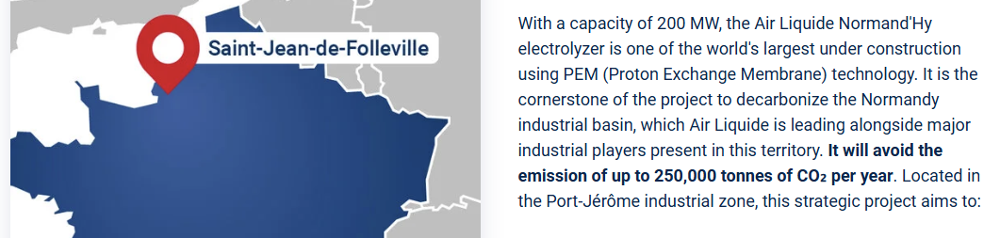
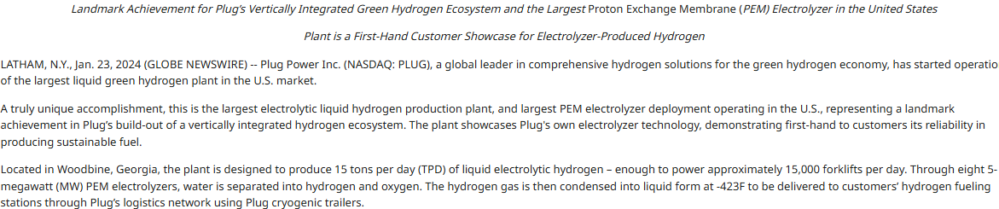
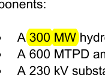
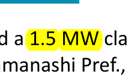
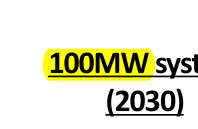
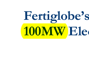
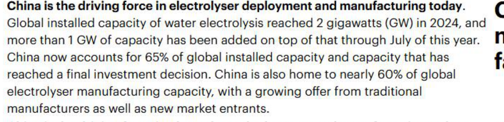
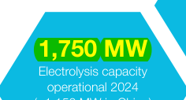
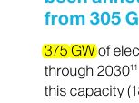

# 글로벌 PEM 수전해 프로젝트 조사 보고서

**작성**: 기술사업화 시장조사팀 · **기준일**: 2026-07-21 · **통화·단위**: 원문 표기 그대로(환산 없음)

---

## 1. 개요와 조사 방법

이 보고서는 전 세계에서 추진 중인 **PEM(양성자교환막, Proton Exchange Membrane) 수전해** 그린수소
프로젝트를 인벤토리 형태로 정리하고, 이를 둘러싼 시장 규모·주요 전해조 제조사·정책 환경을 함께 담는다.

모든 사실성 수치는 **[조사내용 → 출처 → 증빙]** 의 증거구조로 고정되며, 본문의 각 수치 뒤에는 사실대장의
식별자 `(Fxxx)`를 붙였다. 각 섹션은 세 층으로 구성된다 — ① 서술 본문(수치에 `(Fxxx)` 태그) ② 근거표
(사실·수치·출처링크·4차원 등급·증빙) ③ 원문 캡처(핵심 수치의 실제 출처 화면). 4차원 등급은
`권위(authority)/독립성(independence)/직접성(directness)/최신성(recency)`을 각각 A~D로 표기한다.

**조사 범위와 종료 기준.** 지역은 전 세계(유럽·미주·아시아태평양·중동), 프로젝트 상태는 가동중·건설중·
계획(FID/파이프라인)을 모두 포함했다. 지역별 조사원 3인이 프로젝트 인벤토리를, 1인이 시장·플레이어·정책
맥락을 병렬 수집한 뒤, 팀리드가 **모든 확정 수치의 원문을 재열람**하여 대장의 인용문·값이 원문과 일치함을
확인(스냅샷 SHA-256 무결성 + 원문 문장 실존)한 것만 본 보고서에 실었다. 확정 프로젝트가 대표적 규모에
이르고 시장·정책 핵심 수치를 확보한 시점에서 조사를 종료했다.

::: {.caution}
**수치 해석 시 유의.** 계획·건설 단계 프로젝트의 용량·가동시점은 출처·시점에 따라 갱신된다. 또한 "투자
규모(발표치)"와 "실제 수취 보조금·집행액"은 다른 개념이므로, 딜 규모를 실수취액으로 오해하지 않도록
근거표의 정의(definition)를 함께 확인하기 바란다.
:::

---

## 2. PEM 수전해란 무엇이며, 왜 프로젝트 판별이 까다로운가

물을 전기로 분해해 그린수소를 만드는 수전해 기술은 크게 세 갈래 — 알칼라인(Alkaline), PEM, 고온
고체산화물(SOEC) — 로 나뉜다. 이 가운데 **PEM은 고분자 전해질막을 쓰는 방식**으로, 재생에너지의 출력
변동에 빠르게 반응하고 부하 조절이 유연해 태양광·풍력과의 결합에 적합하다는 평가를 받는다. 반면 알칼라인은
저렴한 대용량화에, SOEC는 고온 폐열 활용에 각각 강점이 있다.

프로젝트 인벤토리에서 가장 흔한 함정은 **"전해조 방식(PEM/알칼라인) 오귀속"** 이다. 언론·2차 자료는
프로젝트를 뭉뚱그려 "green hydrogen electrolyzer"로 표기하는 경우가 많아, 실제로는 알칼라인인 사업이
PEM으로 잘못 소개되거나 그 반대가 발생한다. 본 조사는 각 프로젝트의 PEM 여부를 **개발사·전해조 OEM의
1차 원문**으로 확정했고, 방식이 원문에서 확인되지 않은 사업은 인벤토리에서 제외했다(폐기 사유는 내부
감사기록에 보존). 대표적으로 널리 "PEM 후보"로 거론되던 일부 대형 프로젝트가 실제로는 알칼라인이거나
혼합 방식임을 원문 대조로 확인해 배제하거나 부분만 반영했다(아래 중국 사례 참조).

---

## 3. 지역별 PEM 프로젝트 인벤토리

### 3.1 유럽

유럽은 대형 PEM 프로젝트가 가장 밀집한 지역이다. 프랑스 노르망디의 **Air Liquide Normand'Hy**는
200 MW(F001) 규모로 세계 최대급 PEM 전해조 중 하나이며, 전해조는 Siemens Energy가 공급한다(2025년 9월
기준 전해조 모듈 인도가 진행, 상업가동 목표 2026년). 완전가동 시 연 28,000톤(F002)의 재생수소를 생산할
계획이다. 네덜란드 로테르담의 **Air Liquide ELYgator**는 200 MW(F004) 규모로, 한 부지에 PEM과
알칼라인을 결합한 사례이며 연 23,000톤(F005)을 목표로 한다(PEM 스택은 Air Liquide–Siemens Energy
합작사 공급).

독일에서는 Shell이 라인란트 정유단지에서 **REFHYNE** 사업을 단계적으로 키우고 있다. 1단계
**REFHYNE I**은 ITM Power 전해조 기반 10 MW(F011)로 2021년 가동을 시작한 유럽 최초급 PEM 설비였고,
2단계 **REFHYNE II**는 100 MW(F008)로 확장된다(스택 OEM ITM Power, EPC Linde, 가동 목표 2027년).
스페인에서는 **Iberdrola Puertollano** 플랜트가 Nel ASA의 Proton PEM 전해조 20 MW(F013)로 2022년부터
가동 중이며 연 3,000톤(F014)을 인접 Fertiberia 암모니아 공장에 공급한다. 영국에서는 Trafigura 자회사
MorGen Energy가 **West Wales Hydrogen**(밀퍼드헤이븐) 사업에 ITM Power POSEIDON 20 MW(F017)
전해조를 도입해 2026년 3월 FID에 도달했다.

::: {.caution}
**용량 정의 혼선(West Wales).** ITM Power는 "20 MW POSEIDON 모듈"로, Trafigura 보도자료는 각주에서
"전기 입력용량(electrical input capacity) 120 MW(F018)"로 표기한다. 두 수치가 동일 지표인지 별개
개념(그리드 연계용량 등)인지 원문에 설명이 없어, 본 보고서는 두 값을 **하나로 합치지 않고 분리**해
기록한다. 인벤토리 대표 용량으로는 전해조 정격(20 MW)을 채택했다.
:::

#### 근거표 — 유럽

| 사실 | 수치 | 출처 | 등급(권위/독립/직접/최신) | 증빙 |
|---|---|---|---|---|
| Normand'Hy PEM 전해조 용량(Siemens Energy) | 200 MW (F001) | [airliquide.com](https://www.airliquide.com/air-liquide-normandhy) · [IPCEI](https://ipcei.observatory.clean-hydrogen.europa.eu/air-liquide-normandhy-fr07) | A/B/A/A | `_captures/E001.png` |
| Normand'Hy 연간 수소 생산계획 | 28,000 tonnes/year (F002) | [airliquide.com](https://www.airliquide.com/air-liquide-normandhy) | B/B/A/A | — |
| Normand'Hy 전해조 투자액(발표치) | €400 million (F003) | [airliquide.com](https://www.airliquide.com/air-liquide-normandhy) | B/B/A/A | — |
| ELYgator 전해조 용량(PEM+알칼라인) | 200 MW (F004) | [airliquide.com](https://www.airliquide.com/stories/hydrogen/elygator-inside-electrolyzer-construction-site-shaping-future-hydrogen-europe) · [Argus](https://www.argusmedia.com/en/news-and-insights/latest-market-news/2713299-air-liquide-takes-fid-on-dutch-200mw-green-h2-plant) | B/B/A/A | — |
| ELYgator 연간 수소 생산계획 | 23,000 tonnes/year (F005) | [Argus](https://www.argusmedia.com/en/news-and-insights/latest-market-news/2713299-air-liquide-takes-fid-on-dutch-200mw-green-h2-plant) | A/B/A/A | — |
| ELYgator 총 투자비(발표치) | €500 million (F006) | [Argus](https://www.argusmedia.com/en/news-and-insights/latest-market-news/2713299-air-liquide-takes-fid-on-dutch-200mw-green-h2-plant) | A/B/A/A | — |
| REFHYNE II PEM 전해조 용량(ITM Power) | 100 MW (F008) | [refhyne.eu](https://www.refhyne.eu/refhyne-2/) · [ITM](https://itm-power.com/news/100mw-refhyne-ii-contract-signed) | B/C/A/B | — |
| REFHYNE II 연간 수소 생산목표 | 15,000 tonnes/year (F009) | [refhyne.eu](https://www.refhyne.eu/refhyne-2/) | B/B/A/B | — |
| REFHYNE II 일일 수소 생산목표 | 44,000 kg/day (F010) | [ITM](https://itm-power.com/news/100mw-refhyne-ii-contract-signed) | B/C/A/B | — |
| REFHYNE I PEM 전해조 용량(2021 가동) | 10 MW (F011) | [refhyne.eu](https://www.refhyne.eu/shell-starts-up-europes-largest-pem-green-hydrogen-electrolyser/) · [POWER](https://www.powermag.com/shell-starts-up-10-mw-refhyne-hydrogen-electrolyzer-eyes-expansion-to-100-mw/) | B/B/A/D | — |
| REFHYNE I 연간 수소 생산 | 1,300 tonnes/year (F012) | [refhyne.eu](https://www.refhyne.eu/shell-starts-up-europes-largest-pem-green-hydrogen-electrolyser/) | B/B/A/D | — |
| Iberdrola Puertollano 전해조 용량(Nel PEM) | 20 MW (F013) | [iberdrola.com](https://www.iberdrola.com/about-us/power/other-technologies/green-hydrogen/puertollano-green-hydrogen-plant) | B/B/A/B | — |
| Puertollano 연간 수소 생산 | 3,000 tonnes/year (F014) | [iberdrola.com](https://www.iberdrola.com/about-us/power/other-technologies/green-hydrogen/puertollano-green-hydrogen-plant) | B/B/A/B | — |
| Puertollano 프로젝트 투자액 | €150 million (F015) | [iberdrola.com](https://www.iberdrola.com/about-us/power/other-technologies/green-hydrogen/puertollano-green-hydrogen-plant) | B/B/A/B | — |
| Håeolus(노르웨이) 전해조 결합용량(알칼라인+PEM) | 2 MW (F016) | [Clean Hydrogen JU](https://www.clean-hydrogen.europa.eu/projects-dashboard/projects-repository/haeolus_en) | A/B/B/D | — |
| West Wales Hydrogen 전해조 용량(ITM POSEIDON) | 20 MW (F017) | [ITM](https://itm-power.com/news/morgen-energy-20-mw-project-fid-and-ltsa-signed) · [Trafigura](https://www.trafigura.com/news-and-insights/press-releases/2026/trafigura-s-morgen-energy-reaches-final-investment-decision-for-20mw-green-hydrogen-project-in-wales/) | B/B/A/A | — |
| West Wales 전기 입력용량(각주, 정의 불명) | 120 MW (F018) | [Trafigura](https://www.trafigura.com/news-and-insights/press-releases/2026/trafigura-s-morgen-energy-reaches-final-investment-decision-for-20mw-green-hydrogen-project-in-wales/) | B/C/A/A | — |
| West Wales 연간 수소 생산계획 | 2,000 tonnes/year (F019) | [ITM](https://itm-power.com/news/morgen-energy-20-mw-project-fid-and-ltsa-signed) | B/B/A/A | — |

#### 증빙 캡처 — 유럽

### 3.2 미주(북미·남미)

북미는 가동 중인 PEM 설비와 대규모 계획이 공존한다. **Plug Power**는 미국 조지아주 우드바인에서 자체
GenEco PEM 전해조 5 MW급 8기(F020), 총 40 MW로 액체 그린수소 플랜트를 2024년 가동했으며, 설계 생산량은
하루 15 TPD(F021)이다(미국 내 최대 PEM 전해조 배치로 소개). 텍사스에서는 New Fortress Energy가
Plug Power 전해조 기반 120 MW(F023) 그린수소 플랜트를 계획하고 있다.

Cummins(브랜드 Accelera) 계열 전해조도 다수 확인된다. 뉴욕주 나이아가라폴스의 **Linde** 시설은
35 MW(F024) PEM 시스템으로 2025년 9월 가동을 시작했고(가동 시점 기준 미국 내 최대), 캐나다 퀘벡
**베캉쿠르**의 Air Liquide 플랜트는 Cummins 기술 기반 20 MW(F025) PEM 전해조를 2021년부터 운영 중이다.
플로리다 **FPL Cavendish** 허브는 Cummins HyLYZER PEM 5기, 25 MW(F027)로 2024년 시운전을 완료했다.
캐나다 노바스코샤의 **EverWind Point Tupper**는 환경평가 등록서류에 300 MW(F032) 수소 전해 플랜트로
공식 등재되어 있으며 Siemens Energy PEM 기술이 채택됐다(FEED 완료 시점 그린암모니아 생산을 목표).

::: {.caution}
**1차 정부서류가 2차 보도를 정정한 사례(EverWind).** 2차 보도에서는 "500 MW+"로 회자되었으나, 노바스코샤
주정부에 제출된 환경평가 원문(Project #22-8516)은 Phase 1을 **300 MW(F032)** 로 명시한다. 본 보고서는
1차 정부서류 수치를 채택했다. 아울러 EverWind 공식 홈페이지(2026년 접속본)는 동일 Phase 1의 암모니아
목표를 연 20만 톤으로 안내해 FEED 시점의 24만 톤(F033)에서 개정되었으므로, 시점별 수치를 구분해야 한다.
:::

#### 근거표 — 미주

| 사실 | 수치 | 출처 | 등급(권위/독립/직접/최신) | 증빙 |
|---|---|---|---|---|
| Plug Power 우드바인 PEM 전해조 구성 | 8 x 5 MW=40 MW (F020) | [Plug IR](https://www.ir.plugpower.com/press-releases/news-details/2024/Plug-Power-Starts-Production-of-Liquid-Green-Hydrogen-at-its-Georgia-Plant/default.aspx) · [POWER](https://www.powermag.com/plug-powers-georgia-hydrogen-plant-sets-u-s-production-mark/) | A/C/A/B | `_captures/E035.png` |
| Plug 우드바인 설계 생산량(nameplate) | 15 TPD (F021) | [Plug IR](https://www.ir.plugpower.com/press-releases/news-details/2025/Plug-Powers-Georgia-Hydrogen-Plant-Sets-U-S--Production-Record-Using-Plug-Electrolyzer-Technology/default.aspx) | A/C/A/B | — |
| NFE/Plug 텍사스 보몬트 전해조 용량(계획) | 120 MW (F023) | [NFE](https://www.newfortressenergy.com/stories/nfe-enters-agreement-plug-power-120-mw-green-hydrogen-plant-gulf-coast) | A/C/A/C | — |
| Linde 나이아가라폴스 전해조 용량(Accelera) | 35 MW (F024) | [Cummins](https://www.cummins.com/en-na/news/releases/2025/09/03/accelera-cummins-delivers-its-largest-electrolyzer-system-hydrogen) · [IE](https://interestingengineering.com/energy/largest-electrolyzer-system-goes-live) | A/B/A/A | — |
| Air Liquide 베캉쿠르 전해조 용량(Cummins) | 20 MW (F025) | [airliquide.com](https://www.airliquide.com/stories/hydrogen/air-liquide-operates-worlds-largest-pem-electrolyzer-fueled-renewable-energies-sources-canada) | A/C/A/B | — |
| FPL Cavendish 전해조 용량(Cummins HyLYZER) | 25 MW (F027) | [BusinessWire](https://www.businesswire.com/news/home/20220228005567/en/FPL-Announces-Cummins-to-Supply-Electrolyzer-for-Floridas-First-Green-Hydrogen-Plant-Potential-Key-to-Carbon-Free-Electricity) | A/C/A/C | — |
| FPL Cavendish 준공/가동 상태 | 2024 시운전 완료 (F029) | [NextEra](https://newsroom.nexteraenergy.com/Florida-Power-Light-Company-announces-completion-of-clean-hydrogen-hub?l=12) | A/C/A/A | — |
| Nel→DCPUD(워싱턴) 발주 계약금액 | $7 million (F030) | [PRNewswire](https://www.prnewswire.com/news-releases/nel-asa-receives-a-usd-7-million-purchase-order-for-pem-equipment-to-be-deployed-in-the-us-302751359.html) | A/C/A/A | — |
| Nel→미 철강사 발주 전해조 용량 | 2.5 x 2 MW=5 MW (F031) | [PRNewswire](https://www.prnewswire.com/news-releases/nel-asa-receives-purchase-order-for-5-mw-of-containerized-pem-electrolysers-302356213.html) | A/C/A/B | — |
| EverWind Point Tupper Phase 1 전해조 용량(Siemens PEM) | 300 MW (F032) | [Nova Scotia EA](https://novascotia.ca/nse/ea/everwind-point-tupper-green-hydrogen-ammonia-project/everwind-ea-registration-document.pdf) | A/A/A/C | `_captures/E050.png` |
| EverWind Phase 1 그린암모니아 목표(FEED) | 240,000 tonnes/year (F033) | [GlobeNewswire](https://www.globenewswire.com/news-release/2024/04/03/2857428/0/en/EverWind-Fuels-Announces-Completion-of-FEED-for-its-1st-Phase-240-000-Tonne-per-Annum-Green-Hydrogen-to-Green-Ammonia-Plant.html) | A/B/A/C | — |

#### 증빙 캡처 — 미주

### 3.3 아시아·태평양·중동

한국에서는 **한국가스공사(KOGAS)** 가 제주 행원실증단지에 국내 최초 1 MW급 PEM 수전해 시스템(F066)을
구축해 그린수소 생산에 성공했으며(시간당 18 kg/h(F068) 생산), 약 5,000시간 누적 운전으로 총 13 t(F067)을
생산했다. 호주에서는 Orica의 **헌터밸리 수소허브**가 Plug Power 전해조 50 MW(F069)로 FID에 도달했고
(완전가동 시 연 4,700톤(F070) 목표), 호주 ARENA가 생산보조금을 지원한다. 일본은 실증 중심으로,
후쿠시마 다무라시 프로젝트가 Siemens Energy PEM 전해조로 연 1,900톤(F072)을 목표하며, 야마나시현
고메쿠라야마에 NEDO 실증사업으로 1.5 MW(F073) PEM이 설치돼 있고, 히타치조센은 NEDO 그린이노베이션기금
사업으로 2030년까지 100 MW(F074) 대형 PEM 실증을 목표한다. 인도에서는 GreenH Electrolysis가 자국 제조
1 MW(F075) PEM 전해조를 공개(하루 430 kg/day(F076) 사양)해 철도 수소열차 충전소에 적용할 예정이다.
중동에서는 이집트 아인소크나의 **Fertiglobe Egypt Green**이 완공 시 Plug Power 전해조 100 MW(F080)로,
연 15,000톤(F081)의 그린수소를 그린암모니아 원료로 공급할 계획이다(아프리카 최초 통합 그린수소 플랜트).

::: {.caution}
**"200 MW PEM" 오귀속 정정(중국 화전 다마오치).** 2차 자료들은 이 사업을 "200 MW PEM 전해조"로
요약했으나, 국무원 국유자산감독관리위원회(SASAC) 1차 원문 대조 결과 **명목 200 MW는 풍력·태양광
재생에너지 발전설비 용량**이며 전해조가 아니다. 실제 수전해는 알칼라인(11기)과 PEM의 혼합이고, 그중 PEM
부분은 1,000 Nm³/h(F078)에 불과하다(전체 알칼라인+PEM 합산 연 7,800톤(F079) 생산). 이처럼 재생발전
용량과 전해조 용량의 혼동은 PEM 프로젝트 집계에서 특히 흔한 오류다.
:::

#### 근거표 — 아시아·태평양·중동

| 사실 | 수치 | 출처 | 등급(권위/독립/직접/최신) | 증빙 |
|---|---|---|---|---|
| KOGAS 제주 국내최초 PEM 시스템 용량 | 1 MW (F066) | [KOGAS](https://www.kogas.or.kr/site/koGas/bbs/View.do?cbIdx=41&boardIdx=45995&Key=1010202000000) · [뉴시스](https://www.newsis.com/view/NISX20251202_0003424584) | A/C/A/B | — |
| KOGAS 제주 누적 수소 생산(약 5,000시간) | 13 t (F067) | [뉴시스](https://www.newsis.com/view/NISX20251202_0003424584) | B/B/A/A | — |
| KOGAS 제주 시간당 수소 생산속도 | 18 kg/h (F068) | [KOGAS](https://www.kogas.or.kr/site/koGas/bbs/View.do?cbIdx=41&boardIdx=45995&Key=1010202000000) | A/C/A/B | — |
| Orica 헌터밸리 전해조 용량(Plug, FID) | 50 MW (F069) | [GlobeNewswire](https://www.globenewswire.com/news-release/2026/07/07/3323027/9619/en/Plug-Wins-50MW-Electrolyzer-Order-as-Orica-s-Hunter-Valley-Hub-Becomes-the-Largest-Australian-Renewable-Hydrogen-Project-to-Reach-FID.html) · [Ammonia Energy](https://ammoniaenergy.org/articles/orica-reaches-fid-on-hunter-valley-hydrogen-hub) | A/B/A/A | — |
| 헌터밸리 완전가동 연간 수소 생산목표 | 4,700 tonnes/year (F070) | [GlobeNewswire](https://www.globenewswire.com/news-release/2026/07/07/3323027/9619/en/Plug-Wins-50MW-Electrolyzer-Order-as-Orica-s-Hunter-Valley-Hub-Becomes-the-Largest-Australian-Renewable-Hydrogen-Project-to-Reach-FID.html) | A/B/A/A | — |
| 헌터밸리 정부 생산보조금(ARENA) | AUD 432 million (F071) | [Ammonia Energy](https://ammoniaenergy.org/articles/orica-reaches-fid-on-hunter-valley-hydrogen-hub) | A/B/A/A | — |
| 후쿠시마 다무라시 연간 수소 생산목표(Siemens PEM) | 1,900 tonnes/year (F072) | [Siemens Energy](https://www.siemens-energy.com/global/en/home/press-releases/siemens-energy-s-electrolyzer-awarded-to-decarbonize-semiconduct.html) | A/C/A/B | — |
| 고메쿠라야마 PEM 시스템 용량(NEDO) | 1.5 MW (F073) | [NEDO PDF](https://www.nedo.go.jp/content/100956601.pdf) | A/C/A/C | `_captures/E097.png` |
| 히타치조센 NEDO 대형 PEM 목표(2030) | 100 MW (F074) | [NEDO PDF](https://www.nedo.go.jp/content/100956601.pdf) | A/C/A/C | `_captures/E098.png` |
| GreenH(인도) 첫 PEM 전해조 용량 | 1 MW (F075) | [Indian Chemical News](https://www.indianchemicalnews.com/hydrogen/greenh-electrolysis-unveils-its-first-1-mw-pem-electrolyser-manufactured-at-jhajjar-plant-23552) | B/B/A/C | — |
| GreenH 전해조 일일 수소 생산 사양 | 430 kg/day (F076) | [Indian Chemical News](https://www.indianchemicalnews.com/hydrogen/greenh-electrolysis-unveils-its-first-1-mw-pem-electrolyser-manufactured-at-jhajjar-plant-23552) | B/B/A/C | — |
| Sinopec 중원유전 PEM 실증 연간 수소 생산 | 400 tonnes/year (F077) | [FuelCellChina](https://www.fuelcellchina.com/Industry_information_details/130.html) | B/B/A/D | — |
| 화전 다마오치 PEM 부분 수소생산능력 | 1,000 Nm³/h (F078) | [SASAC](http://www.sasac.gov.cn/n2588025/n2588124/c30268693/content.html) · [solarbe](https://h2.solarbe.com/news/20241119/4157.html) | A/B/A/C | — |
| 화전 다마오치 전체(알칼라인+PEM) 연간 수소 | 7,800 tonnes/year (F079) | [SASAC](http://www.sasac.gov.cn/n2588025/n2588124/c30268693/content.html) | A/B/A/C | — |
| Fertiglobe(이집트) 전해조 용량(Plug, 완공) | 100 MW (F080) | [Fertiglobe PDF](https://fertiglobe.com/wp-content/uploads/2024/03/Fertiglobes-Green-Hydrogen-Consortium-Selects-Plug-Power-to-Deliver-World-Scale-Electrolyzer_vF.pdf) · [Orascom](https://orascom.com/updates/fertiglobe-scatec-orascom-construction-and-the-sovereign-fund-of-egypt-start-commissioning-of-egypt-green-africas-first-integrated-green-hydrogen-plant-during-un-climate/) | A/C/A/D | `_captures/E106.png` |
| Fertiglobe 완공 시 연간 수소 생산계획 | 15,000 tonnes/year (F081) | [Orascom](https://orascom.com/updates/fertiglobe-scatec-orascom-construction-and-the-sovereign-fund-of-egypt-start-commissioning-of-egypt-green-africas-first-integrated-green-hydrogen-plant-during-un-climate/) | A/B/A/D | — |

#### 증빙 캡처 — 아시아·태평양·중동

---

## 4. 글로벌 시장 규모와 전망

전 세계 수전해(모든 방식) 설치용량은 빠르게 늘고 있으나, 집계 기관·시점·방법론에 따라 수치가 갈린다.
IEA는 2024년 말 기준 전 세계 설치용량을 2 GW(F034)로 보며(2023년 말 1.4 GW(F037)에서 증가), 이 가운데
**중국이 65%(F035)** 를 차지한다고 밝혔다. 세부적으로 IEA 데이터는 2023년 PEM 세그먼트를 300 MW(F036)로
집계해, PEM이 아직 알칼라인 대비 소수 기술임을 보여준다. 반면 Hydrogen Council(McKinsey 공동)은 2024년
5월 기준 설치용량을 1,750 MW(F038)로 집계하고, 기술이 명시된 물량 내에서 PEM이 25%(F039), 특히
유럽·북미에서는 PEM이 60%(F040)를 차지한다고 본다.

제조능력과 파이프라인 전망도 출처별로 상충한다. IEA는 2023년 전 세계 제조능력을 연 25 GW(F041)로,
Hydrogen Council은 2024년 5월 기준 약 17 GW(F042)로 집계한다. 2030년 파이프라인은 IEA가 진척도에 따라
230 GW(F043)~520 GW(F044)로, Hydrogen Council이 375 GW(F045)로 제시하며, IEA NZE(넷제로) 시나리오는
2030년까지 560 GW(F046)가 필요하다고 본다.

::: {.caution}
**상충 수치는 은폐하지 않고 병기한다.** 위 IEA와 Hydrogen Council의 설치용량·제조능력·파이프라인 수치가
서로 다른 것은 집계 시점(IEA 2024년 말 vs HC 2024년 5월)과 방법론(예: IEA 2023년 nominal facility size
vs HC OEM 발표 집계)이 다르기 때문이다. 어느 한쪽을 "정답"으로 취하지 않고 두 출처를 모두 제시한다.
:::

#### 근거표 — 시장 규모·전망

| 사실 | 수치 | 출처 | 등급(권위/독립/직접/최신) | 증빙 |
|---|---|---|---|---|
| 전 세계 설치 수전해 용량(IEA, 모든 방식) | 2 GW (F034) | [IEA GHR2025](https://www.iea.org/reports/global-hydrogen-review-2025/executive-summary) | A/A/A/A | `_captures/E054.png` |
| 설치용량 중 중국 비중(IEA) | 65% (F035) | [IEA GHR2025](https://www.iea.org/reports/global-hydrogen-review-2025/executive-summary) | A/A/A/A | — |
| PEM 세그먼트 설치용량(IEA, 2023) | 300 MW (F036) | [IEA electrolysers](https://www.iea.org/energy-system/low-emission-fuels/electrolysers) | A/A/A/B | — |
| 전 세계 설치 수전해 용량(IEA, 2023) | 1.4 GW (F037) | [IEA electrolysers](https://www.iea.org/energy-system/low-emission-fuels/electrolysers) | A/A/A/B | — |
| 전 세계 설치용량(Hydrogen Council, 2024-05) | 1,750 MW (F038) | [Hydrogen Council](https://hydrogencouncil.com/wp-content/uploads/2024/09/Hydrogen-Insights-2024.pdf) | B/B/A/A | `_captures/E058.png` |
| 기술명시 물량 내 PEM 비중(HC) | 25% (F039) | [Hydrogen Council](https://hydrogencouncil.com/wp-content/uploads/2024/09/Hydrogen-Insights-2024.pdf) | B/B/A/A | — |
| 유럽·북미 PEM 비중(HC) | 60% (F040) | [Hydrogen Council](https://hydrogencouncil.com/wp-content/uploads/2024/09/Hydrogen-Insights-2024.pdf) | B/B/A/A | — |
| 전 세계 전해조 제조능력(IEA, 2023) | 25 GW/year (F041) | [IEA electrolysers](https://www.iea.org/energy-system/low-emission-fuels/electrolysers) | A/A/A/B | — |
| 전 세계 전해조 제조능력(HC, 2024-05) | 17 GW/year (F042) | [Hydrogen Council](https://hydrogencouncil.com/wp-content/uploads/2024/09/Hydrogen-Insights-2024.pdf) | B/B/A/A | — |
| 2030 파이프라인 하한(IEA, 주요 프로젝트) | 230 GW (F043) | [IEA electrolysers](https://www.iea.org/energy-system/low-emission-fuels/electrolysers) | A/A/A/B | — |
| 2030 파이프라인 상한(IEA, 초기단계 포함) | 520 GW (F044) | [IEA electrolysers](https://www.iea.org/energy-system/low-emission-fuels/electrolysers) | A/A/A/B | — |
| 2030 발표 파이프라인(HC) | 375 GW (F045) | [Hydrogen Council](https://hydrogencouncil.com/wp-content/uploads/2024/09/Hydrogen-Insights-2024.pdf) | B/B/A/A | `_captures/E065.png` |
| 2030 NZE 필요 설치용량(IEA 시나리오) | 560 GW (F046) | [IEA electrolysers](https://www.iea.org/energy-system/low-emission-fuels/electrolysers) | A/A/A/B | — |

#### 증빙 캡처 — 시장 규모

---

## 5. 주요 PEM 전해조 제조사(플레이어)

PEM 전해조 공급망은 소수의 글로벌 제조사가 주도한다. **Siemens Energy**는 베를린 기가팩토리(Air Liquide
합작)에서 연 3 GW(F047) 규모 PEM 생산능력을 확보했으며, 이 설비를 재생에너지로 가동하면 연 300,000톤
(F048)의 그린수소에 해당한다고 밝혔다. **Cummins(Accelera)** 는 벨기에 오벨 공장의 PEM 제조능력을
1 GW(F049)로 확장 중이며, 캐나다 베캉쿠르에서 당시 세계 최대인 20 MW(F050) PEM을 가동한다고 밝혔다.
영국 **ITM Power**는 셰필드 기가팩토리의 PEM 제조능력을 1,000 MW(F051)로, 미국 **Plug Power**는
로체스터 기가팩토리의 PEM 스택 생산능력을 연 2.5 GW(F052)로 제시한다(이 수치는 연료전지 스택 포함). 노르웨이/미국
**Nel ASA**는 미국 월링포드 PEM 라인을 2025년까지 500 MW(F054)로 확장하고, 별도로 노르웨이 헤뢰야
알칼라인 라인 1 GW(F055) 및 미국 기가팩토리 최대 4 GW(F056) 잠재력(PEM+알칼라인 합산)을 발표했다.

::: {.caution}
**제조능력 수치의 정의 주의.** 위 수치들은 각사 발표 기준의 "설계·목표 생산능력"으로, 실제 가동률·양산
실적과는 다를 수 있다. 특히 Plug Power 2.5 GW(F052)는 연료전지와 전해조 스택을 합산한 수치이고, Nel의
헤뢰야 1 GW(F055)와 4 GW(F056)에는 PEM이 아닌 알칼라인 물량이 포함된다.
:::

#### 근거표 — 주요 플레이어

| 사실 | 수치 | 출처 | 등급(권위/독립/직접/최신) | 증빙 |
|---|---|---|---|---|
| Siemens Energy 베를린 PEM 제조능력 | 3 GW/year (F047) | [Siemens Energy](https://www.siemens-energy.com/us/en/home/stories/electrolyzer-gigawatt-factory.html) | B/B/A/B | — |
| Siemens Energy 3GW 가동 시 수소 환산 | 300,000 tonnes/year (F048) | [Siemens Energy](https://www.siemens-energy.com/us/en/home/stories/electrolyzer-gigawatt-factory.html) | B/B/A/B | — |
| Cummins(Accelera) 벨기에 PEM 제조능력 | 1 GW/year (F049) | [Cummins](https://www.cummins.com/kr-kr/news/releases/2022/09/08/cummins-scaling-belgium-electrolyzer-manufacturing-capacity-1-gigawatt) | B/B/A/C | — |
| Cummins 베캉쿠르 가동 PEM 용량 | 20 MW (F050) | [Cummins](https://www.cummins.com/kr-kr/news/releases/2022/09/08/cummins-scaling-belgium-electrolyzer-manufacturing-capacity-1-gigawatt) | B/B/A/C | — |
| ITM Power 셰필드 PEM 제조능력 | 1,000 MW (F051) | [ITM](https://itm-power.com/news/manufacturing-commences-at-the-itm-power-gigafactory) | B/B/A/C | — |
| Plug Power 로체스터 PEM 스택 생산능력(연료전지 포함) | 2.5 GW/year (F052) | [SEC(Plug)](https://www.sec.gov/Archives/edgar/data/1093691/000110465922057476/tm2214908d1_ex99-1.htm) | B/B/A/C | — |
| Nel ASA 미국 월링포드 PEM 제조능력 목표 | 500 MW (F054) | [Nel](https://nelhydrogen.com/articles/in-depth/expanding-production-capacity-in-wallingford/) | B/B/A/B | — |
| Nel ASA 노르웨이 헤뢰야 알칼라인 제조능력 | 1 GW/year (F055) | [Nel](https://nelhydrogen.com/articles/in-depth/expanding-production-capacity-in-wallingford/) | B/B/A/B | — |
| Nel ASA 미국 기가팩토리 잠재 능력(PEM+알칼라인) | 4 GW (F056) | [Nel](https://nelhydrogen.com/articles/in-depth/expanding-production-capacity-in-wallingford/) | B/B/A/B | — |

---

## 6. 정책·규제 환경

PEM 수전해 프로젝트의 경제성은 정책 인센티브에 크게 좌우된다. 미국은 인플레이션감축법(IRA) **제45V조
청정수소 생산세액공제**로, 임금·견습요건 충족 시 2025년 기준 수명주기 배출 구간에 따라 kg당
$3.185(F057)(최고)·$1.065(F058)·$0.795(F059)·$0.635(F060)를 차등 지급한다. 유럽연합은 **RED III
(지침 (EU) 2023/2413)** 로 재생수소(RFNBO) 수요를 의무화한다 — 산업부문은 2030년까지 42%(F061),
2035년까지 60%(F062)를 RFNBO로 충당해야 하며(제22a조), 일정 조건 충족 시 2030년 목표를 20%(F065)
완화할 수 있다(제22b조). 교통부문에는 첨단연료·RFNBO 합산 목표와 함께, 그 안에서 RFNBO 단독으로
최소 1퍼센트포인트(F064)를 부과한다(제25조, 합산 목표치는 근거표 F063 참조).

#### 근거표 — 정책·규제

| 사실 | 수치 | 출처 | 등급(권위/독립/직접/최신) | 증빙 |
|---|---|---|---|---|
| IRA 45V 최고 세액공제(2025, PWA 충족) | $3.185/kg (F057) | [Congress CRS](https://www.congress.gov/crs-product/IF12602) | A/A/A/A | — |
| IRA 45V 2구간 세액공제 | $1.065/kg (F058) | [Congress CRS](https://www.congress.gov/crs-product/IF12602) | A/A/A/A | — |
| IRA 45V 3구간 세액공제 | $0.795/kg (F059) | [Congress CRS](https://www.congress.gov/crs-product/IF12602) | A/A/A/A | — |
| IRA 45V 최저구간 세액공제 | $0.635/kg (F060) | [Congress CRS](https://www.congress.gov/crs-product/IF12602) | A/A/A/A | — |
| RED III 산업부문 RFNBO 목표(2030, 제22a조) | 42% (F061) | [EUR-Lex](https://eur-lex.europa.eu/eli/dir/2023/2413/oj/eng) | A/A/A/A | — |
| RED III 산업부문 RFNBO 목표(2035) | 60% (F062) | [EUR-Lex](https://eur-lex.europa.eu/eli/dir/2023/2413/oj/eng) | A/A/A/A | — |
| RED III 교통부문 합산 목표(2030, 제25조) | 5.5% (F063) | [EUR-Lex](https://eur-lex.europa.eu/eli/dir/2023/2413/oj/eng) | A/A/A/A | — |
| RED III 교통 RFNBO 단독 최소(2030) | 1%p (F064) | [EUR-Lex](https://eur-lex.europa.eu/eli/dir/2023/2413/oj/eng) | A/A/A/A | — |
| RED III 산업목표 완화율(2030, 제22b조) | 20% (F065) | [EUR-Lex](https://eur-lex.europa.eu/eli/dir/2023/2413/oj/eng) | A/A/A/A | — |

---

## 7. 종합

#### 한눈에 요약표 — 대표 PEM 프로젝트

| 지역 | 프로젝트 | 국가 | 전해조 OEM | 용량 | 상태 | F-ID |
|---|---|---|---|---|---|---|
| 유럽 | Air Liquide Normand'Hy | 프랑스 | Siemens Energy | 200 MW | 건설중(가동 2026) | F001 |
| 유럽 | Air Liquide ELYgator | 네덜란드 | Siemens Energy(PEM)+알칼라인 | 200 MW | 건설중(가동 2027) | F004 |
| 유럽 | Shell REFHYNE II | 독일 | ITM Power | 100 MW | 건설중(가동 2027) | F008 |
| 유럽 | Shell REFHYNE I | 독일 | ITM Power | 10 MW | 가동중(2021~) | F011 |
| 유럽 | Iberdrola Puertollano | 스페인 | Nel ASA | 20 MW | 가동중(2022~) | F013 |
| 유럽 | West Wales Hydrogen | 영국 | ITM Power | 20 MW | FID(2026-03) | F017 |
| 미주 | Plug Power Woodbine | 미국(GA) | Plug Power | 40 MW | 가동중(2024~) | F020 |
| 미주 | NFE/Plug 텍사스 보몬트 | 미국(TX) | Plug Power | 120 MW | 계획 | F023 |
| 미주 | Linde 나이아가라폴스 | 미국(NY) | Accelera/Cummins | 35 MW | 가동중(2025-09~) | F024 |
| 미주 | Air Liquide 베캉쿠르 | 캐나다 | Cummins | 20 MW | 가동중(2021~) | F025 |
| 미주 | FPL Cavendish | 미국(FL) | Cummins | 25 MW | 가동중(2024~) | F027 |
| 미주 | EverWind Point Tupper | 캐나다 | Siemens Energy | 300 MW | 계획 | F032 |
| 아태 | KOGAS 제주 행원 | 한국 | (미기재) | 1 MW | 실증완료 | F066 |
| 아태 | Orica 헌터밸리 | 호주 | Plug Power | 50 MW | FID(2026-07) | F069 |
| 아태 | 고메쿠라야마(NEDO) | 일본 | (Hitachi Zosen) | 1.5 MW | 가동중 | F073 |
| 아태 | 히타치조센 대형 실증 | 일본 | Hitachi Zosen | 100 MW | 계획(2030 목표) | F074 |
| 아태 | GreenH Jind | 인도 | GreenH | 1 MW | 실증(제조공개) | F075 |
| 중동 | Fertiglobe Egypt Green | 이집트 | Plug Power | 100 MW | 건설중 | F080 |

#### 조사팀 인사이트

- **[사실]** PEM은 전 세계 설치 수전해 중 여전히 소수 기술이다. IEA 기준 PEM 세그먼트는 300 MW(F036)로, 같은 해 전체 1.4 GW(F037)의 약 5분의 1 수준이다.
- **[추론]** 다만 지역별 편차가 크다. Hydrogen Council은 유럽·북미에서 PEM 비중을 60%(F040)로 집계했고, 본 인벤토리의 대형 프로젝트도 유럽·북미·호주에 집중된다. 이는 PEM이 재생에너지 변동성 대응이 중시되는 선진 시장에서 상대적 강세를 보임을 시사한다 (F001, F020, F069).
- **[사실]** 전해조 OEM은 소수로 집중되어 있다. 본 인벤토리 대표 프로젝트의 공급사는 Siemens Energy·ITM Power·Cummins(Accelera)·Plug Power·Nel ASA로 수렴한다 (F001, F008, F013, F020, F024).
- **[추론]** 정책 인센티브가 프로젝트 실현의 핵심 변수다. 미국은 45V로 kg당 최대 $3.185(F057)를 지급하고, EU는 RED III로 산업부문 42%(F061) RFNBO 의무를 부과해 각각 북미·유럽 파이프라인을 뒷받침한다.
- **[사실]** 프로젝트 판별에서 "재생발전 용량 ≠ 전해조 용량", "PEM ≠ 알칼라인"의 혼동이 실제로 빈번하다. 중국 화전 다마오치의 명목 "200 MW"는 재생발전 용량이며, 실제 PEM 부분은 1,000 Nm³/h(F078)에 불과했다.

#### 한계와 반론

- **집계 수치의 출처 간 상충.** 시장 규모·제조능력·파이프라인은 IEA와 Hydrogen Council이 서로 다른 값을
  제시한다(설치용량 2 GW(F034) vs 1,750 MW(F038) 등). 이는 집계 시점·방법론 차이에서 비롯되며, 어느
  하나를 단일 정답으로 삼기 어렵다. 본 보고서는 양측을 병기했다.
- **계획단계 수치의 변동성.** 계획·FID 단계 프로젝트의 용량·생산목표·가동시점은 사업 진행에 따라 갱신된다
  (예: EverWind 암모니아 목표가 24만 톤(F033)에서 20만 톤으로 개정). 미래 시점 수치는 "목표치"로 읽어야 한다.
- **용량 지표의 정의 불일치.** West Wales의 "20 MW 전해조"(F017)와 "120 MW 전기 입력용량"(F018)처럼 동일
  프로젝트에 상이한 정의의 용량이 공존한다. 본 보고서는 이를 합치지 않고 분리 기록했다.
- **일부 프로젝트는 방식 미확인으로 제외.** PEM 여부가 원문에서 확인되지 않은 사업(예: 일부 MENA 초대형
  프로젝트)은 인벤토리에서 제외했으므로, 본 인벤토리가 전 세계 PEM 프로젝트를 망라한 것은 아니다.
